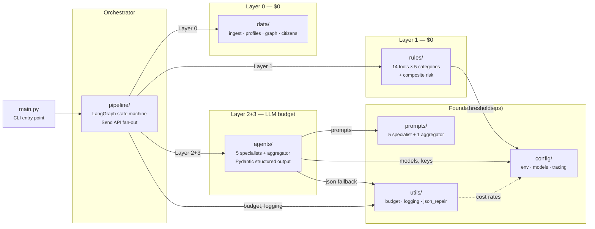
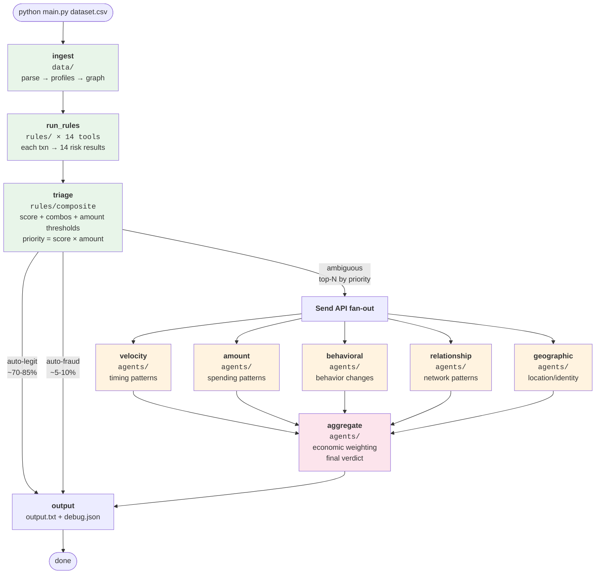

# Reply AI Agent Challenge 2026

> **Date**: April 16, 2026 · 15:30–21:30 CEST (6 hours)
> **Team**: 3 members · **Prize**: €2,500/member (1st place)
> **Output**: `.txt` file listing fraudulent transaction IDs + source code `.zip`

---

## Competition Rules

- Input: financial transaction datasets (JSON or CSV)
- Output: `.txt` file listing fraudulent transaction IDs + source `.zip`
- **5 datasets**: 1-3 available at start; 4-5 unlock after submitting eval for 1-3
- **Token budgets**: $40 for datasets 1-3 · $120 for datasets 4-5 (OpenRouter) — non-refillable
- **Submissions**: unlimited on training · **one shot only** on evaluation
- **LLM must orchestrate**: deterministic rules must be LangChain tools the agent decides to invoke
- **Tracing**: Langfuse mandatory — session ID required in every submission

### Scoring

| Criterion | What it measures |
|---|---|
| **Count-based accuracy** | How many fraudulent txns you correctly identify |
| **Economic accuracy** | How much fraud value (€) you recover — €50k fraud >> €5 one |
| **Cost efficiency** | How sustainable your LLM token usage is |
| **Latency** | How fast your system processes transactions |
| **Architecture quality** | How well-designed your multi-agent system is |

---

## Architecture: 5-Layer Triage Funnel

The key insight: most transactions are obviously legit. Cheap filters first,
expensive LLM calls only for the ambiguous middle.

```
RAW DATASET (directory)
        │
        ▼
┌─────────────────────────────────┐
│  Layer 0: Data Ingestion        │  $0 — parse transactions + citizen data
│  data/                          │  profiles, graph, users, locations, status, personas
└────────────┬────────────────────┘
             │
             ▼
┌─────────────────────────────────┐
│  Layer 0.5: Citizen Pre-Analysis│  ~1 LLM call per citizen (cached)
│  agents/citizen_analyst.py      │  Contradictions, vulnerability, expected behavior
└────────────┬────────────────────┘
             │
             ▼
┌─────────────────────────────────┐
│  Layer 1: Rule Triage           │  $0 — 14 LangChain tools × 5 categories
│  rules/                         │  Weighted score + combos + amount scaling
│  ~70-85% filtered out           │  Priority ranking: score × amount
└────────────┬────────────────────┘
             │ (~15-30% ambiguous)
             ▼
┌─────────────────────────────────┐
│  Layer 2: 5 Specialists         │  ~60% budget — parallel via Send API
│  agents/specialists.py          │  velocity · amount · behavioral · relationship · geographic
│  Structured output enforced     │  Each: {risk_level, confidence, patterns, reasoning}
└────────────┬────────────────────┘
             │
             ▼
┌─────────────────────────────────┐
│  Layer 3: Aggregator            │  ~40% budget — economic weighting
│  agents/aggregator.py           │  Final verdict: {is_fraud, confidence, reasoning}
└────────────┬────────────────────┘
             │
      output.txt + debug.json
```

All LLM calls are cached locally (`.llm_cache/`) — re-runs with identical
inputs skip the LLM entirely.

---

## Module Map

```
reply-hackathon/
├── main.py                  # CLI entry point (18 lines)
│
├── config/                  # Environment, models, Langfuse tracing
│   ├── CONFIG.md
│   ├── env.py               # .env loading + fail-fast validation
│   ├── models.py             # Model names, token limits, cost rates, LLM_BASE_URL
│   └── tracing.py            # Langfuse v3 callback handler, ULID session IDs
│
├── data/                    # Layer 0 — parsing, profiles, graph, citizens (implemented)
│   ├── DATA.md
│   ├── ingest.py             # FIELD_MAP + passthrough (adjust on hackathon day)
│   ├── profiles.py           # O(n) precomputed account profiles
│   ├── graph.py              # Relationship graph with clustering coefficients
│   └── citizens.py           # Multi-modal citizen context (users, locations, status, personas)
│
├── rules/                   # Layer 1 — 14 deterministic tools (implemented)
│   ├── RULES.md
│   ├── _types.py             # RiskLevel, weights, combos, thresholds (~35 constants)
│   ├── time.py               # check_velocity, check_temporal_pattern, check_card_testing
│   ├── amount.py             # check_amount_anomaly, check_balance_drain, check_first_large
│   ├── behavioral.py         # check_new_payee, check_dormant_reactivation, check_frequency_shift
│   ├── graph.py              # check_fan_in, check_fan_out, check_mule_chain, check_circular_flow
│   └── geographic.py         # check_impossible_travel (location vs citizen home)
│
├── prompts/                 # System prompts for all LLM agents
│   ├── PROMPTS.md
│   ├── specialists.py        # VELOCITY_PROMPT, AMOUNT_PROMPT, BEHAVIORAL_PROMPT, RELATIONSHIP_PROMPT, GEOGRAPHIC_PROMPT
│   └── aggregator.py         # AGGREGATOR_PROMPT
│
├── agents/                  # Layers 0.5+2+3 — citizen analyst + specialists + aggregator
│   ├── AGENTS.md
│   ├── citizen_analyst.py    # Layer 0.5: LLM pre-analysis of citizen risk profiles
│   ├── specialists.py        # Layer 2: 5 specialist nodes + Pydantic SpecialistOutput
│   └── aggregator.py         # Layer 3: aggregator node + Pydantic AggregatorOutput
│
├── pipeline/                # LangGraph state machine (implemented)
│   ├── PIPELINE.md
│   ├── state.py              # PipelineState with budget + priority + debug output
│   ├── dispatch.py           # Tool context routing for 14 rule tools
│   ├── nodes.py              # All node functions (ingest → analyze_citizens → triage → specialists → aggregate → output)
│   └── graph.py              # StateGraph wiring with Send API fan-out
│
├── utils/                   # Cross-cutting helpers
│   ├── UTILS.md
│   ├── json_repair.py        # Fallback JSON parser (structured output is primary)
│   ├── llm_cache.py          # Local LLM inference cache (SHA-256 key, JSON file store)
│   ├── budget.py             # BudgetTracker with panic mode at 15%
│   └── logging.py            # Structured logger
│
├── requirements.txt
└── .env                     # OPENROUTER_API_KEY, LANGFUSE_*, TEAM_NAME
```

---

## Module Dependency Map



### Execution Order



---

## Key Design Decisions

### Data: Minimal Contract + Passthrough
We don't know the dataset format until hackathon day. Six guaranteed keys
(`id`, `sender_id`, `receiver_id`, `amount`, `timestamp`, `sender_balance`)
plus all raw fields preserved. On hackathon day, update `FIELD_MAP` in
`data/ingest.py` — nothing else changes.

### Rules: 5 Categories, ~35 Configurable Thresholds
All magic numbers live in `rules/_types.py`. On hackathon day, see the data
distribution and adjust — no other file needs to change.

| Category | Tools | Weight |
|---|---|---|
| Time | check_velocity, check_temporal_pattern, check_card_testing | 0.5–1.5× |
| Amount | check_amount_anomaly, check_balance_drain, check_first_large | 1.0–1.5× |
| Behavioral | check_new_payee, check_dormant_reactivation, check_frequency_shift | 1.0× |
| Graph | check_fan_in, check_fan_out, check_mule_chain, check_circular_flow | 2.0× |
| Geographic | check_impossible_travel | 2.0× |

### Triage: Score × Amount Priority
Ambiguous transactions ranked by `composite_score × amount`. A mediocre-risk
€50k transaction gets LLM analysis before a high-risk €5 one. Budget-aware:
when tokens run low, process fewer ambiguous txns; at 15% remaining, skip LLM
entirely.

### Specialists: 5 Parallel via Send API
One specialist per rule category. LangGraph's `Send` API launches all 5
concurrently — latency = slowest specialist, not the sum. Each gets curated
context (not the full state). Structured output enforced via `response_format`
+ Pydantic validation.

### Error Handling: Amount-Aware
- Txn > €1k + specialist fails → retry once
- Txn ≤ €1k + specialist fails → skip, use remaining specialists
- All fail → fallback to rule-based verdict

### Output: txt + debug.json
`output.txt` for submission. `debug.json` with full per-txn trace (L1 scores,
specialist reasoning, aggregator verdict, priority rank, verdict source) for
tuning between dataset runs.

---

## Token Budget

**Datasets 1-3 ($40)**

| Layer | Txns | Tokens/txn | Model | Est. cost |
|---|---|---|---|---|
| 0 + 1 | all | 0 | — | $0 |
| 2 (5 specialists) | ~500 | ~300 × 5 | configurable | varies |
| 3 (aggregator) | ~500 | ~800 | configurable | varies |
| **Total** | | | | **depends on provider** |

With local Ollama: $0.00. With OpenRouter: depends on model choice.
Toggle `LLM_BASE_URL` in `config/models.py` between local and remote.

**Datasets 4-5 ($120)**: same architecture, consider upgrading specialist model.

---

## Hackathon Day Playbook

### First 15 minutes — Data exploration
1. Open the dataset, inspect field names and types
2. Update `FIELD_MAP` in `data/ingest.py`
3. Run `parse_dataset()` and check output
4. Look at amount distribution, timestamp range, account count

### Next 30 minutes — Threshold tuning
1. Run Layer 0+1 on training data
2. Check triage split: what % auto-legit, auto-fraud, ambiguous?
3. Adjust thresholds in `rules/_types.py` until ~15-30% is ambiguous
4. Check `debug.json` for false positives/negatives

### Remaining time — LLM layers
1. Implement specialist stubs (wire LLM calls)
2. Test on training data, check Langfuse traces
3. Monitor budget, adjust triage if needed
4. Submit evaluation — **one shot only**

---

## Risk Mitigation

| Risk | Mitigation |
|---|---|
| Token budget exhausted | BudgetTracker with panic mode. Priority ranking spends tokens where they matter most. |
| Unexpected dataset format | FIELD_MAP pattern — 1 dict to update. Passthrough preserves all fields. |
| LLM returns bad output | Belt and suspenders: response_format + Pydantic + json_repair fallback. |
| Specialist fails | Amount-aware retry (>€1k) or skip (≤€1k). All 5 fail → rule verdict. |
| Langfuse connection fails | Session IDs generated client-side. Log locally as backup. |
| Wrong output format | debug.json lets you inspect every verdict before submitting. |

---

## Pre-Challenge Checklist

- [x] Modular architecture: 8 packages with clean boundaries
- [x] LangGraph pipeline with Send API fan-out (11 nodes)
- [x] 14 rule tools with ~35 configurable thresholds
- [x] 5 specialist prompts + aggregator prompt + citizen analysis prompt
- [x] Budget tracking with panic mode
- [x] Structured output enforcement (Pydantic + response_format)
- [x] Data layer fully implemented (ingest + profiles + graph + citizens)
- [x] Multi-modal citizen data ingestion (users, locations, status, personas)
- [x] Citizen pre-analysis agent (Layer 0.5) with contradiction detection
- [x] Rule tool bodies implemented (all 14 incl. geographic)
- [x] Specialist LLM calls wired up (all 5 + aggregator)
- [x] Langfuse v3 tracing with ULID session IDs
- [x] LLM inference cache (instant re-runs for unchanged inputs)
- [x] End-to-end test on sample data via local Ollama
- [ ] `.env` configured with challenge API keys (at start)
- [ ] Update FIELD_MAP for actual dataset format (at start)
