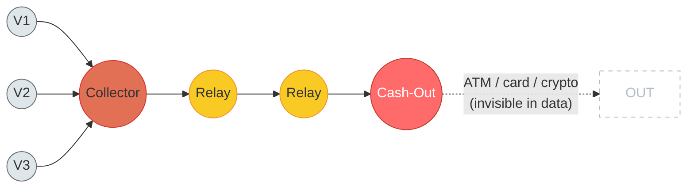
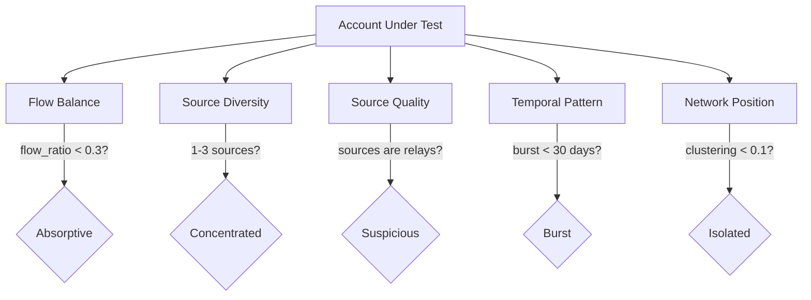

# Cash-Out Endpoint Detection

## 1. What is a Cash-Out Endpoint?

A cash-out endpoint is the final destination where stolen money comes to rest. It is the account that *keeps* the money -- the whole point of committing fraud.

Think of a fraud ring as a river system. Victims are the headwaters -- money is siphoned from their accounts and flows downstream through a series of intermediary accounts:

```
VICTIMS  -->  COLLECTORS  -->  RELAYS  -->  CASH-OUT
(source)      (aggregate)     (obscure)    (extract)
```

Collectors gather money from multiple victims. Relays shuffle it around to break the trail. But eventually, all of that money must arrive somewhere a real person can withdraw or spend it. That somewhere is the cash-out endpoint -- the ocean where the river terminates.

**Why it matters:** Every fraud scheme, no matter how complex the routing, MUST have an extraction point. Money that never reaches a cash-out is money that was never successfully stolen. The cash-out is not optional -- it is the objective.

**Why start detection here:** Our approach is "fraudster-first" -- we begin at cash-out endpoints and trace backward. This works because cash-outs have the most constrained structural shape of any node in the fraud ring. Collectors and relays can mimic normal transaction patterns (receiving and forwarding money looks a lot like a business or a person paying bills). But cash-outs cannot mimic normalcy because their defining behavior -- absorbing money -- leaves an unavoidable fingerprint in the transaction graph.

### Cash-Out Graph Topology



The cash-out (red) is a dead-end **in the transfer dataset**. Money enters from the relay pipeline but exits through channels the data cannot see -- ATM withdrawals, card purchases, crypto on-ramps. These happen on different rails (card networks, ATM networks) and don't produce a `sender_id, receiver_id` row. From the graph's perspective, money enters the cash-out and vanishes.


## 2. Why Cash-Outs Cannot Hide

The fundamental constraint is simple: legitimate accounts have roughly balanced flow.

Over time, a normal person receives money (salary, transfers, refunds) and sends money out (rent, bills, purchases). The ratio of outflow to inflow hovers around 1.0. There are exceptions -- savings accounts accumulate, spending accounts drain -- but even these tend to show balanced patterns when viewed at the right timescale.

A cash-out account MUST absorb. That is its entire purpose. Money flows in from the fraud ring, and very little or nothing flows out. The fraudster either withdraws as cash, converts to cryptocurrency, or purchases goods -- none of which appear as outgoing transfers in the banking ledger.

**Critical assumption:** This fingerprint depends on the dataset containing only account-to-account transfers (the hackathon format: sender_id, receiver_id, amount). In this format, cash withdrawals and card purchases are invisible -- they happen outside the graph. The cash-out truly appears absorptive. However, if the dataset includes ALL transaction types (like PaySim's CASH_OUT type, which represents ATM withdrawals as explicit transactions), the cash-out's outflow IS visible in the data, and the flow ratio approaches 1.0. In that case, Fingerprint 1 collapses and the detection pipeline needs different entry signals. Before running this pipeline, verify what transaction types exist in the dataset.

This creates an unavoidable structural fingerprint -- given the account-to-account transfer format. The cash-out cannot "act normal" by sending money back out, because doing so would defeat the purpose of the fraud. The stolen money needs to be *extracted*, not recirculated.

Even the common evasion tactic of splitting across many small cash-out accounts backfires. Each small account still shows the same absorptive pattern, and now there are MORE anomalous accounts to detect, not fewer. Splitting increases the detection surface rather than reducing it.


## 3. The Five Fingerprints

No single metric reliably identifies a cash-out. But cash-out endpoints exhibit a specific combination of five independent characteristics. Each fingerprint measures a different dimension -- flow, sources, source quality, time, and network position -- and their convergence on a single account is extremely difficult to replicate by accident.

---

### Fingerprint 1: Absorptive Flow

**What it measures:** Does money go in and not come out?

An absorptive account receives far more than it sends. The simplest way to quantify this is the flow ratio:

```
flow_ratio = total_sent / total_received
```

For a normal account, this ratio sits between 0.7 and 1.1 -- roughly balanced, with natural variance. A cash-out account has a flow ratio below 0.3, meaning it keeps 70% or more of everything it receives.

**False positive risk:** Savings accounts, investment accounts, and inheritance recipients also show low flow ratios. A newly opened savings account that has received three deposits and made zero withdrawals looks absorptive. This is why absorptive flow alone is not sufficient -- it is necessary but not diagnostic.

**Why it matters anyway:** While not sufficient alone, absorptive flow is necessary. A cash-out that does not absorb is a contradiction in terms. This fingerprint acts as a first-pass filter that eliminates the vast majority of accounts from further analysis.

---

### Fingerprint 2: Concentrated Inbound Sources

**What it measures:** Does the account receive money from very few counterparties?

A cash-out typically receives from 1 to 3 accounts -- the relay nodes funneling stolen money into it. Compare this to a legitimate business that might receive payments from dozens or hundreds of customers, or even a normal person who receives from an employer, family members, friends, and various refund sources.

```
source_count = number of unique accounts that sent money to this account
```

A cash-out shows a source count of 1 to 3. But here is the subtlety: a savings account also has a source count of 1 (the owner's checking account or employer). The raw count alone does not distinguish them. What differs is the *character* of those sources, which is why Fingerprint 3 is critical.

**Why it matters:** Concentrated sources tell us the account is not participating in broad economic activity. It is receiving from a narrow, specific pipeline. Combined with absorptive flow, this narrows the field considerably -- but the real separation comes from examining *who* those sources are.

---

### Fingerprint 3: Suspicious Sources (The Two-Hop Test)

**What it measures:** Are the accounts that send money to this account themselves suspicious?

This is the most powerful fingerprint and the hardest for a fraudster to defeat.

The test is straightforward: look at the accounts that send money to the suspected cash-out. Are they normal, established accounts with their own legitimate transaction history? Or are they relay-like accounts -- pass-through nodes with short histories, asymmetric flow, and no community embedding of their own?

A savings account receives from an employer. That employer is a well-established node in the transaction graph: high transaction volume, many counterparties, long history, embedded in a cluster of other businesses and employees. It is clearly legitimate.

A cash-out receives from relay accounts. Those relays receive from collectors, which receive from victims. The relays themselves show suspicious patterns: they receive and forward in rapid succession, they have short lifespans, they connect to no broader economic community.

**Why this is so hard to fake:** To defeat this test, a fraudster would need to make the source accounts look legitimate. But to make the sources look legitimate, THEIR sources would also need to look legitimate. And so on. The cost of deception escalates exponentially with each hop backward through the chain.

This is a recursive defense. At some point in the chain, there must be a real victim whose account was drained or a synthetic identity with no legitimate history. The two-hop test finds where the fabrication breaks down.

**This is what separates real detections from false positives.** A savings account with absorptive flow and one source passes the two-hop test because its source is an established employer. A cash-out with absorptive flow and one source fails because its source is a freshly created relay with its own suspicious fingerprints.

---

### Fingerprint 4: Burst Activity Pattern

**What it measures:** Is the account's activity compressed into a short window?

Cash-out accounts are disposable infrastructure. They are created or acquired (e.g., via a bought/stolen identity), used intensively for a brief period while the fraud is active, and then abandoned. This produces a distinctive temporal signature:

```
silence --> burst of activity --> silence
```

The account sits dormant (or does not exist yet), then receives a rapid series of transfers over days or weeks, then goes quiet again. Compare this to a savings account that accumulates deposits slowly over months or years, or a checking account with steady, regular activity.

The metric here combines two elements:

- **Active window**: the time between the first and last observed transaction. Cash-outs have narrow windows (under 30 days is common).
- **Density**: the number of transactions per day within that window. Cash-outs pack many transactions into their short window.

A new employee might show a burst-like pattern in their first month (suddenly receiving a paycheck, paying deposits on an apartment). But their activity continues and stabilizes -- it does not abruptly stop. A cash-out's burst is terminal.

---

### Fingerprint 5: No Community Embedding

**What it measures:** Is the account a dead-end branch in the transaction network, or part of a real economic community?

Real economic activity is embedded in meshes. A person pays their landlord, and their landlord pays a maintenance company, and the maintenance company pays suppliers who also serve other landlords. There are reciprocal relationships, shared counterparties, and dense clusters of interconnected accounts.

A cash-out is connected to the fraud ring and nothing else. It is a dangling appendage -- a leaf node or near-leaf node in the graph. It has no reciprocal relationships (nobody it pays also pays it back). It shares no counterparties with its neighbors. Its clustering coefficient -- the measure of how interconnected its neighbors are with each other -- is near zero.

```
clustering_coefficient(A) = (edges among A's neighbors) / (maximum possible edges among A's neighbors)
```

For a cash-out, this is typically below 0.1. Its few connections (the relay nodes feeding it) are not themselves connected to each other in a meaningful economic cluster. The cash-out hangs off the graph like a branch that leads nowhere.


## 4. How Fingerprints Compound

Any single fingerprint can be coincidence:
- A savings account is absorptive. (Fingerprint 1)
- A new employee has few inbound sources. (Fingerprint 2)
- A recently opened account has a burst-like first month. (Fingerprint 4)

Two fingerprints reduce the false positive rate dramatically. An account that is both absorptive AND has a burst pattern is less likely to be a savings account (which accumulates slowly).

Three or four fingerprints converging on the same account pushes coincidence into implausibility. An account that absorbs money, from very few sources, whose sources are themselves suspicious relay-like accounts, with all activity compressed into two weeks, and no connection to any economic community -- that is not a savings account.

The power of this approach comes from the fingerprints being **independent signals**. They measure fundamentally different dimensions:

| Fingerprint | Dimension | Question |
|---|---|---|
| Absorptive Flow | Flow balance | Where does the money go? |
| Concentrated Sources | Source diversity | Who sends money here? |
| Suspicious Sources | Source quality | Are the senders legitimate? |
| Burst Activity | Temporal pattern | When does activity happen? |
| No Community | Network topology | How is this account situated? |

Because these dimensions are orthogonal, an account that "explains away" one fingerprint (e.g., a savings account explaining absorptive flow) will not simultaneously explain the others (a savings account does not have suspicious sources or zero community embedding).

### Fingerprint Independence



Each fingerprint tests a different dimension. An account that triggers all five is exhibiting a pattern that no single legitimate account type can explain away.

Five independent signals converging on the same account is a conjunction that legitimate accounts almost never satisfy.


## 5. Technical Section: Scoring a Cash-Out

```
CASH-OUT SCORE ALGORITHM

Input: account A, transaction graph G, all account profiles P

---

Step 1 -- Flow Ratio

  flow_ratio(A) = total_sent(A) / total_received(A)
  If total_received(A) = 0 --> skip (no inbound activity, not a cash-out)
  If flow_ratio < 0.3 --> absorptive_signal = TRUE

---

Step 2 -- Source Concentration

  sources(A) = set of unique accounts that sent money to A
  If 1 <= |sources(A)| <= 3 --> concentrated_signal = TRUE

---

Step 3 -- Two-Hop Source Quality

  For each source S in sources(A):
    relay_score(S) = is_relay(S, G, P)    // returns 0.0 to 1.0
  avg_relay = mean(relay_score for all S)
  If avg_relay > 0.5 --> suspicious_sources_signal = TRUE

---

Step 4 -- Temporal Burst

  active_window(A) = last_seen(A) - first_seen(A)
  density = txn_count(A) / max(active_window_days(A), 1)
  If active_window < 30 days AND density > 1 txn/day --> burst_signal = TRUE

---

Step 5 -- Isolation

  cc(A) = clustering_coefficient(A)
  deg(A) = degree(A)     // total unique counterparties
  If cc(A) < 0.1 AND deg(A) <= 5 --> isolated_signal = TRUE

---

Step 6 -- Composite Score

  weights:
    absorptive        = 0.25
    concentrated      = 0.15
    suspicious_sources = 0.30
    burst             = 0.15
    isolated          = 0.15

  score = sum( weight_i * signal_i )     where signal_i = 1 if TRUE, 0 if FALSE

  // Convergence bonus: reward accounts where many independent signals fire
  If count(TRUE signals) >= 4:
    score = min(score * 1.3, 1.0)

  If score > 0.7 --> CLASSIFY AS CASH-OUT ENDPOINT
```

### Weight Rationale

**Suspicious sources (0.30) -- heaviest weight.** This signal is weighted highest because it is the hardest for a fraudster to defeat. Unlike the other fingerprints, which measure properties of a single account, the two-hop test examines the account's *context* in the graph. Faking it requires making the source accounts look legitimate, which requires making their sources look legitimate, and so on. The cost of deception is recursive and exponential. No other fingerprint has this self-reinforcing property.

**Absorptive flow (0.25) -- second heaviest.** Absorption is the defining characteristic of a cash-out. Without it, the account is not extracting value from the fraud ring. While it has false positives (savings accounts), it is a near-universal true positive -- almost every real cash-out will trigger this signal.

**Concentrated sources, burst activity, and isolation (0.15 each).** These three signals are supporting evidence. Each is informative but has broader overlap with legitimate account patterns:
- Concentrated sources overlap with accounts that simply have few financial relationships.
- Burst activity overlaps with newly opened accounts in their first month.
- Isolation overlaps with accounts that are genuinely peripheral (elderly person with one bank relationship).

Individually, they are weak. But when they co-occur with absorptive flow and suspicious sources, they eliminate the remaining false positive explanations.

**The convergence bonus (1.3x at 4+ signals)** rewards the conjunction itself. An account that triggers four or five independent signals is exhibiting a pattern that is qualitatively different from one that triggers two. The bonus reflects the diminishing probability that coincidence explains the convergence.

**Important caveat on all weights:** These weights are educated starting points, not empirically calibrated values. They were chosen based on reasoning about which signals are hardest to fake and most discriminative, but they have NOT been validated against labeled data. When implementing, treat them as initial values to be tuned against the training dataset. Run the scoring algorithm, compare results to known labels, and adjust weights to optimize F1 score. The rationale above explains the *ordering* of weights (suspicious_sources > absorptive > the rest), which should be stable. The exact numeric values will need calibration.

### Role Comparison at a Glance

|  | Collector | Relay | Cash-Out |
|---|---|---|---|
| **Flow ratio** | varies | 0.85 -- 0.99 | < 0.3 |
| **Inbound** | many (strangers) | few (upstream pipeline) | few (relays) |
| **Outbound** | few (to pipeline) | few (downstream pipeline) | near-zero |
| **Hold time** | days | hours | n/a (absorbs) |
| **Clustering** | low | low | < 0.1 |
| **Key signal** | strangers test | amount correlation + hold time | absorptive flow |
| **Hardest to fake** | cross-connection metric | network position | two-hop source quality |

This table summarizes all three roles from docs 01-03. Each role has a unique structural fingerprint that the others lack. The pipeline flows left to right: collectors feed relays, relays feed cash-outs.


## 6. Practical Considerations

### False Positive Management: The Ambiguous Zone (0.5 -- 0.7)

Accounts scoring above 0.7 are classified as cash-out endpoints with high confidence. Accounts below 0.5 are dismissed. But the zone between 0.5 and 0.7 is ambiguous -- these accounts show some cash-out characteristics but not enough for automatic classification.

These ambiguous cases should be routed to an LLM agent for contextual analysis. The LLM can examine the specific combination of signals, consider edge cases the rule system cannot anticipate (e.g., an account that is absorptive and isolated but has a plausible explanation in its transaction narrative), and make a nuanced judgment. The rule-based score gives the LLM a structured starting point rather than asking it to evaluate from scratch.

### Sparse Graph Handling

With a dataset of 5,000 transactions, some accounts will have very few transactions -- perhaps only one or two. For these accounts, most fingerprint metrics are unreliable:

- A flow ratio computed from one inbound and zero outbound transactions is technically 0.0 (maximally absorptive), but a single transaction is not evidence of systematic absorption.
- A clustering coefficient is meaningless for an account with one neighbor.
- A burst window of one transaction is not a burst.

The safest approach is to require a minimum transaction count (e.g., 3 or more) before computing fingerprints. Accounts below this threshold can be flagged for manual review if they appear in the neighborhood of confirmed fraud nodes, but should not receive an automated cash-out score.

### Scale

For a dataset of 5,000 transactions, every computation described above is millisecond-fast. Building the transaction graph, computing flow ratios, counting sources, measuring clustering coefficients, and scoring every account is pure graph computation with no machine learning inference cost. The two-hop test is the most expensive step (it requires evaluating source accounts), but even this is bounded by the graph's degree distribution. In practice, the entire pipeline runs in well under a second.

At much larger scales (millions of transactions), the same approach holds but benefits from graph database indexing and batch computation. The algorithmic complexity is linear in the number of accounts for single-account metrics and at most quadratic in local neighborhood size for clustering coefficients.

### Threshold Sensitivity

The 0.7 classification threshold is a precision-recall tradeoff:

- **Raising the threshold (e.g., 0.8):** Increases precision -- fewer false positives, but some real cash-outs with partial fingerprints will be missed. This is appropriate when false positives are costly (e.g., freezing legitimate accounts).
- **Lowering the threshold (e.g., 0.6):** Increases recall -- catches more real cash-outs, but more legitimate accounts will be flagged. This is appropriate when missing a fraud case is costlier than investigating a false alarm.

For a hackathon context where the goal is to demonstrate detection capability, a threshold of 0.7 balances these concerns. In production, the threshold would be tuned against labeled data using precision-recall curves, and the ambiguous zone would be handled by escalation to human review or LLM analysis rather than by moving the hard cutoff.
