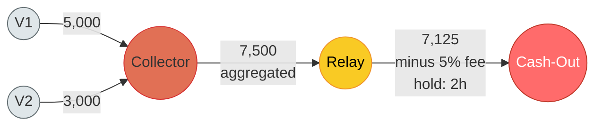
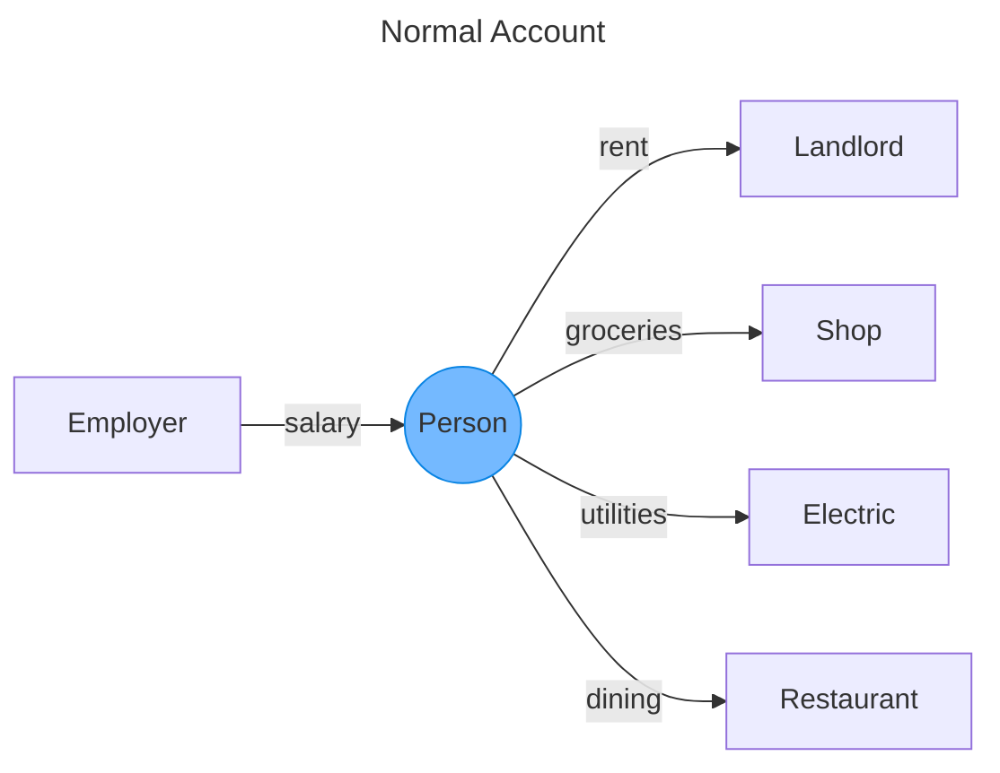
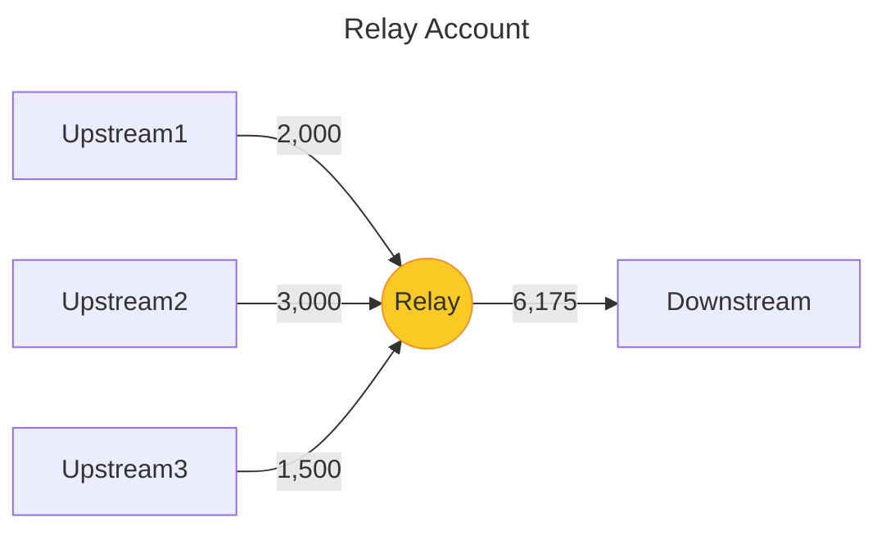
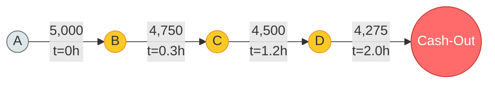
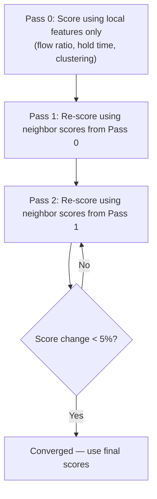

# Relay Detection

> **Role in the pipeline**: Relays are the SECOND role to identify, after cash-out
> endpoints. Once we know where money exits the system, we trace backward to find
> the middlemen who carried it there.

---

## 1. What Is a Relay Account?

A relay is a middleman. It receives money from one direction and forwards it in
another. Its job is to create distance between the crime (the initial theft or
scam) and the extraction (the cash-out).

Other names for the same concept: mule, layerer, pass-through, intermediary.
Anti-money-laundering (AML) literature calls this the "layering" phase -- the
stage where stolen funds are moved through enough accounts that tracing the
origin becomes difficult. Each hop adds a layer of separation between the victim
and the fraudster.

The core reason relays exist is deniability. If a victim reports fraud and the
bank traces the money, a direct path (victim -> cash-out) is trivially
detectable. But victim -> A -> B -> C -> cash-out requires investigators to
follow four hops, often across different banks, jurisdictions, or time windows.
More hops = harder to trace = more time for the fraudster to disappear.

**The river analogy.** If the fraud network is a river system:

- **Victims** are the springs -- where water enters the system
- **Collectors** are the streams -- gathering water from multiple springs
- **Relays are the rapids** -- they carry water from streams toward the ocean, fast and without holding it
- **Cash-out endpoints** are the ocean -- where the water accumulates and disappears

### Relay graph topology



> The relay (yellow) is a pipe, not a reservoir. Money passes through with a
> small fee deducted and minimal delay. The key distinguishing features are the
> short hold time and the systematic fee pattern.

---

## 2. How Relays Differ from Normal Accounts

At first glance, a relay looks like any other account. Everyone receives money
and sends money. Your salary comes in, your rent goes out. So what makes a relay
different?

Two fundamental differences: the **relationship** between inbound and outbound
flows, and the **hold time**.

### Relationship between inbound and outbound

A normal person has *asymmetric* flows:

- **Inbound**: one stable source (employer), maybe a few (side job, family).
  Concentrated, predictable, regular cadence.
- **Outbound**: many different recipients -- rent, utilities, groceries,
  subscriptions, restaurants. Diversified, variable amounts, irregular timing.

The pattern is: concentrated in, diversified out. Money arrives from one place
and scatters to many places.

A relay has the opposite asymmetry, or no asymmetry at all:

- **Inbound**: multiple upstream sources (collectors or other relays). Several
  senders, potentially unfamiliar, with irregular but clustered timing.
- **Outbound**: one or few downstream recipients (other relays or cash-out
  endpoints). Money funnels rather than scatters.

The pattern is: multiple in, concentrated out. Money gathers from several
sources and funnels to a narrow destination. This is the inverse of a normal
consumer account.





> Normal accounts have concentrated inbound (one employer) and diversified
> outbound (many expenses). Relays have the opposite: diversified inbound from
> the pipeline and concentrated outbound to the next hop.

### Hold time

Normal account: money stays for days or weeks between arriving and leaving.
You receive your salary on the 1st, pay rent on the 5th, buy groceries
throughout the month. The account acts as a **reservoir** -- it holds money.

Relay account: money is forwarded within hours, sometimes minutes. The relay
doesn't want to hold stolen money (risk of seizure), and the orchestrator
doesn't want delays (the victim might report the fraud). The account acts as a
**pipe** -- money flows through without stopping.

This distinction is powerful because legitimate rapid forwarding is rare. The
few cases where it occurs (escrow closings, currency exchange) are one-off
events, not recurring patterns. A relay shows this behavior repeatedly.

---

## 3. The Four Signatures of a Relay

A relay leaves four distinct fingerprints. No single fingerprint is conclusive
on its own -- each has legitimate explanations. But when multiple fingerprints
appear on the same account, the probability of innocent explanation drops
rapidly.

### Signature 1: Pass-Through Flow

The relay is a pipe, not a reservoir. What goes in comes back out.

**The metric**: forwarding ratio = total amount sent / total amount received.

For most people, this ratio is somewhere around 0.7 to 1.1. You receive your
salary and you spend most of it (ratio near 1.0), or you save some (ratio below
1.0), or you dip into savings occasionally (ratio above 1.0 for a period).

For a relay, this ratio is specifically in the **0.85 to 0.99** range. The relay
forwards almost everything but keeps a small cut. Why the cut? Mule recruiters
pay their mules a percentage -- typically 5-10% -- as compensation for the risk
of lending their account. So a relay that receives 10,000 might forward 9,200
and keep 800.

The range matters. A ratio of 0.50 means the account is keeping half -- that is
a normal account spending its income. A ratio of exactly 1.00 is suspicious but
rare (no fee retained). The sweet spot of 0.85-0.99 reflects the economics of
mule recruitment: the mule must be compensated, but the orchestrator wants to
maximize throughput.

Why this is necessary but not sufficient: many legitimate accounts also have
ratios in this range. A student living paycheck-to-paycheck who spends 95% of
their income is a pass-through by this metric alone. The forwarding ratio is a
filter, not a verdict.

### Signature 2: Short Hold Time

The time gap between receiving money and forwarding it is unusually short.

**The metric**: for each incoming transaction, find the next outgoing
transaction. The gap between them is the hold time. Take the median of all
such gaps.

Normal account: hold times measured in **days**. You get paid on Monday, pay
rent on Friday. The median gap might be 3-7 days.

Relay account: hold times measured in **hours or minutes**. The handler (the
person orchestrating the mule) instructs the mule to forward the money as soon
as it arrives. Delays increase the risk that the bank freezes the account or
the victim's bank issues a recall.

This is a strong signal because the intersection of "receives money and sends
it out the same day, repeatedly" is a small set of accounts. Legitimate
scenarios exist -- a business that processes payments daily, for example -- but
they tend to involve established counterparties and consistent amounts, unlike
the variable sources and amounts of a relay.

Hold times under 1 hour are especially suspicious. At that speed, the account
holder is essentially sitting at their phone waiting for the deposit notification
before initiating the outbound transfer. That is the behavior of someone
following instructions, not someone going about their day.

### Signature 3: Correlated Amounts

The amounts received and forwarded are not independent -- they track each other.

In a normal account, what you receive (salary: a fixed amount) and what you
spend (variable expenses: groceries, dining, bills) are weakly correlated at
best. Your salary doesn't determine tonight's dinner bill.

In a relay, the outgoing amount is *derived from* the incoming amount. Three
common derivation patterns:

**Full forward minus fee.** The simplest pattern. Receive 1,000, send 950.
Receive 2,000, send 1,900. The outgoing amount is consistently 95% (or 90%, or
92%) of the incoming amount. The percentage stays stable because the mule's
commission rate is fixed.

**Aggregation then forward.** The relay collects several smaller deposits, then
forwards the sum minus a cut. Receive 500 + 500 + 500 over a few hours, then
send 1,400. The outgoing amount roughly equals the sum of recent incoming
amounts, minus the fee.

**Split and forward.** The relay receives one large amount and distributes it
downstream. Receive 3,000, then send 1,000 + 1,000 + 900 to different
recipients. The sum of outgoing amounts (2,900) is close to the incoming amount
minus the fee.

In all three patterns, the relationship between in and out is systematic, not
random. A legitimate account might occasionally send an amount close to what
it received, but as a repeated pattern, amount correlation is highly
discriminative.

### Signature 4: Network Position

The relay sits between other suspicious accounts in the transaction graph.

Inbound neighbors are collectors (high fan-in) or other relays. Outbound
neighbors are other relays or cash-out endpoints (high absorption, no outflow).
The relay is a bridge in the suspicious subgraph.

Formally, this corresponds to high **betweenness centrality** on the fraud
subgraph: if you remove the relay node, upstream accounts lose their path to
downstream cash-outs. The relay also has low **clustering coefficient** -- its
neighbors don't transact with each other. It is a bridge, not a member of a
community.

This is the most powerful signature because it is the hardest to fake. A
fraudster can adjust amounts (Signature 3) or add delays (Signature 2) to
evade detection. But the network topology -- the fact that the relay's neighbors
are themselves suspicious -- cannot be changed without restructuring the entire
fraud ring.

This is the same principle as Cash-Out Fingerprint 3 ("are this account's
sources suspicious?"), applied one step further upstream.

---

## 4. Distinguishing Relays from Legitimate Pass-Through Accounts

This is the hardest part of relay detection. Several legitimate account types
naturally exhibit relay-like signatures. The table below maps each lookalike
to the specific signal that separates it from a true relay.

| Legitimate account | Why it looks like a relay | Why it is NOT a relay | Distinguishing signal |
|---|---|---|---|
| **Business operating account** | Receives from many sources (customers), pays many recipients (suppliers, employees). High throughput, balanced in/out. | Has long account history. Counterparties are stable and reciprocal (same suppliers appear month after month). Forms a community (suppliers also transact with each other). | Account age, partner consistency over time, high clustering coefficient. |
| **Joint / family account** | Receives from multiple family members, pays household expenses. Multiple senders, multiple receivers. | Transfers are bidirectional -- the same people appear as both senders and receivers. A relay's flow is strictly one-directional (upstream -> relay -> downstream). | Bidirectional edges between the account and its counterparties. |
| **Escrow / intermediary** | Literally receives money and forwards it. The entire business model is pass-through. | Registered financial entity. Amounts are large, highly regular, and tied to documented contracts. Transaction cadence is predictable (monthly closings, quarterly settlements). | Amount regularity, institutional identity, predictable timing patterns. |
| **Currency exchange** | Receives in one form, sends in another. High throughput, short hold times. | Cross-currency nature is explicit in the data (if currency fields are available). Amounts follow published exchange rates, not arbitrary fee deductions. | Currency field mismatch, rate-aligned amounts. |

The single strongest distinguisher across all of these: **relay accounts connect
to OTHER suspicious accounts** (Signature 4). A business operating account
connects to established suppliers and customers. A family account connects to
family members with their own normal histories. An escrow connects to banks and
law firms. A relay connects to collectors and cash-outs -- accounts that
themselves exhibit anomalous patterns.

Two-hop analysis resolves most ambiguity. Ask not just "does this account look
like a relay?" but "does this account look like a relay AND connect to accounts
that look like collectors or cash-outs?" The conjunction is what separates
signal from noise.

---

## 5. The Special Case: Chain of Relays

Sometimes the fraud ring uses 3, 4, or 5 relays in sequence:
A -> B -> C -> D -> cash-out.

Each individual relay in the chain might have low degree -- it receives from one
upstream account and sends to one downstream account. By degree alone, it looks
like a normal person paying someone. No fan-in, no fan-out, no obvious network
anomaly.

The chain becomes visible only when you examine the **sequence** rather than
individual nodes:

- A sends 5,000 to B. B sends 4,750 to C (20 minutes later). C sends 4,500 to
  D (45 minutes later). D sends 4,275 to a known cash-out endpoint (1 hour
  later).
- Each hop: amount decreases by roughly 5%. Time between hops is under 1 hour.
  Every node in the chain exhibits Signatures 1 (pass-through), 2 (short hold),
  and 3 (correlated amounts).

The individual nodes are innocuous. The chain is not. When you see a sequence
where each hop preserves 90-95% of the amount and occurs within hours, you are
looking at a pipeline.



> Each hop retains ~95% of the previous amount and occurs within minutes to
> hours. Individually, each node looks like a normal person paying someone.
> The chain is what reveals the pipeline.

**Detection approach**: look for paths of length 3+ where:

1. Each hop retains 85-99% of the previous hop's amount
2. Each hop occurs within a short time window (e.g., < 6 hours)
3. The final recipient is a suspected cash-out endpoint or has no further
   outbound (terminus)

This is the "mule chain" pattern. It is expensive to detect (requires
pathfinding on the transaction graph), but it catches relay structures that
single-node analysis misses entirely.

---

## 6. Technical Section: Relay Detection Algorithm

The algorithm below combines the four signatures into a composite score. It is
designed to run after cash-out detection, so that cash-out scores are available
as inputs to Signature 4 (network position).

```
RELAY DETECTION ALGORITHM

Input:
  A        -- account to evaluate
  G        -- transaction graph (nodes = accounts, edges = transactions)
  P        -- precomputed account profiles (from Layer 0)
  CO_scores -- cash-out scores from prior detection pass

------------------------------------------------------------------------

Step 1 -- Forwarding Ratio (pass-through detection)

  forwarding_ratio(A) = total_sent(A) / total_received(A)

  If total_received(A) = 0:
    pass_through_signal = FALSE    (no inbound flow to forward)

  If 0.70 <= forwarding_ratio <= 0.99:
    pass_through_signal = TRUE
    (The account forwards most of what it receives, keeping a small cut)

  If 0.90 <= forwarding_ratio <= 0.97:
    tight_band_bonus = TRUE
    (The narrower range suggests a fixed commission rate -- stronger signal)

------------------------------------------------------------------------

Step 2 -- Hold Time (forwarding speed)

  For each incoming transaction T_in to A:
    Find next outgoing transaction T_out from A
      where T_out.timestamp > T_in.timestamp
    hold_time = T_out.timestamp - T_in.timestamp

  median_hold = median(all hold_times)

  CAVEAT: This greedy pairing (each inbound matched to the chronologically
  next outbound) can misfire when an account mixes fraud and legitimate
  transactions. Example:
    T1: Receive 5000 from collector (fraud)
    T2: Pay 50 rent (legitimate, was already scheduled)
    T3: Forward 4700 to cash-out (fraud, the actual paired action)
  Greedy pairing matches T1->T2 (short hold time, wrong pair) and
  leaves T3 unmatched. This contaminates both hold time AND amount
  correlation (Signature 3). A more robust approach: match by amount
  similarity (T1 and T3 are within 6% of each other) rather than
  pure chronological order. Or compute hold time both ways and take
  the minimum as a conservative estimate.

  If median_hold < 24 hours:
    fast_forward_signal = TRUE

  If median_hold < 1 hour:
    very_fast_forward_signal = TRUE   (stronger weight applied later)

------------------------------------------------------------------------

Step 3 -- Amount Correlation (fee pattern detection)

  incoming_amounts = [amounts received by A, sorted by time]
  outgoing_amounts = [amounts sent by A, sorted by time]

  -- Check for fixed-fee forwarding pattern --
  match_count = 0
  For each outgoing amount O:
    Find closest incoming amount I (by time proximity) such that:
      0.85 * I <= O <= I
      (outgoing is 85-100% of a recent incoming -- consistent with 0-15% fee)
    If match found:
      match_count += 1

  If match_count / len(outgoing_amounts) > 0.50:
    amount_correlation_signal = TRUE
    (More than half of outgoing amounts match the fee-deduction pattern)

  -- Check for aggregation pattern --
  For sliding windows of N incoming txns (N = 2..5):
    If abs(sum(window) - sum(next M outgoing txns)) / sum(window) < 0.15:
      aggregation_signal = TRUE
      (Incoming amounts are batched and forwarded as a lump sum minus fee)

------------------------------------------------------------------------

Step 4 -- Suspicious Neighbors (network position)

  downstream_accounts = outbound_neighbors(A) in G
  upstream_accounts  = inbound_neighbors(A) in G

  suspicious_downstream = 0
  For each D in downstream_accounts:
    If CO_score(D) > 0.5 OR relay_score(D) > 0.5:
      suspicious_downstream += 1

  suspicious_upstream = 0
  For each U in upstream_accounts:
    If relay_score(U) > 0.5 OR collector_score(U) > 0.5:
      suspicious_upstream += 1

  If suspicious_downstream > 0:
    suspicious_position_signal = TRUE
    (At least one downstream neighbor is a suspected cash-out or relay)

  If suspicious_upstream > 0 AND suspicious_downstream > 0:
    bridge_bonus = TRUE
    (Account bridges suspicious upstream to suspicious downstream)

------------------------------------------------------------------------

Step 5 -- Composite Relay Score

  base_score = 0

  Weights:
    w_pass_through       = 0.20
    w_hold_time          = 0.25
    w_amount_correlation = 0.25
    w_suspicious_position = 0.30

  If pass_through_signal:    base_score += w_pass_through
  If fast_forward_signal:    base_score += w_hold_time
  If amount_correlation_signal OR aggregation_signal:
                              base_score += w_amount_correlation
  If suspicious_position_signal:
                              base_score += w_suspicious_position

  -- Apply bonuses for strong signals --
  If very_fast_forward_signal:  base_score *= 1.15
  If tight_band_bonus:          base_score *= 1.10
  If bridge_bonus:              base_score *= 1.15

  -- Final classification --
  If base_score > 0.60:
    CLASSIFY A AS RELAY
    relay_score(A) = base_score
```

### Weight rationale

The weights reflect how discriminative each signal is and how hard it is for
a legitimate account to accidentally trigger it.

| Signal | Weight | Reasoning |
|---|---|---|
| **Suspicious position** | 0.30 | Hardest to fake. A fraudster can adjust amounts and timing, but cannot change the fact that their neighbors are also suspicious. Same principle as cash-out Fingerprint 3. |
| **Hold time** | 0.25 | Highly discriminative. Legitimate fast forwarding (same-day in and out, repeatedly) is genuinely rare. The few exceptions (payment processors) are identifiable by other means. |
| **Amount correlation** | 0.25 | The fee pattern (receive X, forward X minus 5-10%) is distinctive. Random chance produces this occasionally, but as a persistent pattern across many transactions, it is strongly indicative. |
| **Pass-through flow** | 0.20 | Necessary condition but not sufficient. Many legitimate accounts are roughly balanced (students, low-income earners spending most of their income). On its own, this is the weakest signal. |

**Important caveat on all weights:** These are educated starting points, not empirically calibrated. The relative ordering (suspicious position > hold time = amount correlation > pass-through) reflects reasoning about discriminative power, but the exact numeric values need tuning against labeled training data. Run the algorithm, compare to known labels, adjust.

---

## 7. How Relay Detection Feeds Into Cash-Out Detection

Relay detection and cash-out detection are interdependent.

Cash-out detection asks: "Are this account's inbound sources suspicious?" The
answer depends on whether those sources are relays. But relay detection asks:
"Are this account's downstream neighbors suspicious cash-outs?" The answer
depends on whether those neighbors have been identified as cash-outs.

This is a circular dependency:

```
cash-out score depends on --> relay scores of inbound neighbors
relay score depends on    --> cash-out scores of outbound neighbors
```

### Resolution: iterative convergence

**Pass 1 -- Flow-only signals.** Run both cash-out and relay detection using
only flow-based signatures (forwarding ratio, hold time, amount correlation).
Ignore network position (Signature 4 / Fingerprint 3) entirely. This produces
initial scores based purely on each account's own behavior.

**Pass 2 -- Incorporate neighbor scores.** Re-run both detectors, now using
the scores from Pass 1 to evaluate network position. A relay whose downstream
neighbor scored 0.8 as a cash-out in Pass 1 gets a boost. A cash-out whose
upstream neighbor scored 0.7 as a relay in Pass 1 gets a boost.

**Pass 3 (if needed) -- Refinement.** Re-run again with Pass 2 scores. In
practice, scores converge after 2-3 iterations for typical fraud networks. The
change between Pass 2 and Pass 3 is usually less than 5% for any given account.

This iterative approach mirrors how belief propagation works in graphical
models: local evidence (flow signals) initializes beliefs, then neighboring
beliefs propagate through the network until the system stabilizes.



> The circular dependency (relay scores need cash-out scores, cash-out scores
> need relay scores) is resolved by iterating until scores stabilize. Typically
> converges in 2-3 passes.
