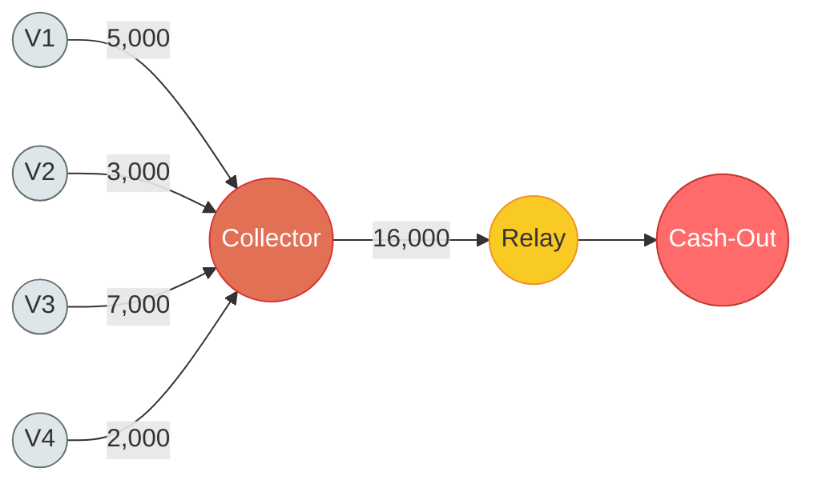
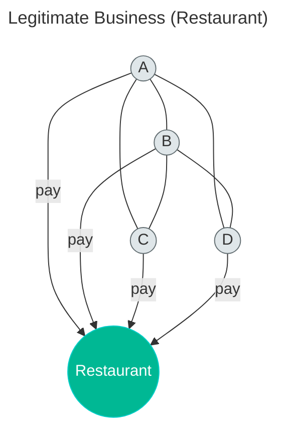
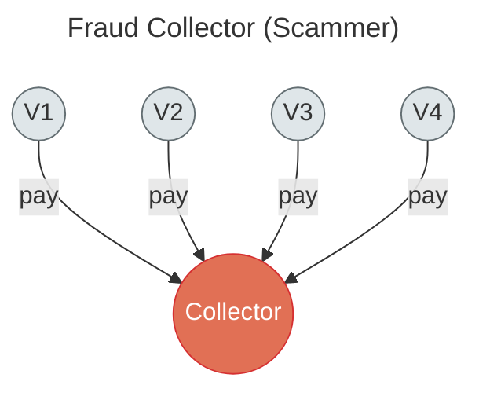
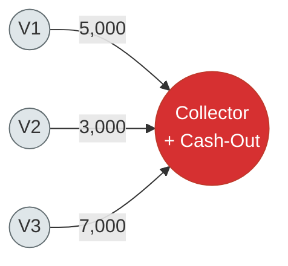

# Collector Detection

## 1. What Is a Collector Account?

A collector is the account that gathers stolen money from victims. It is the **first point of entry** into the fraud pipeline -- the place where money leaves a victim's control and enters the fraudster's system.

In the river analogy we've been using: if cash-outs are the ocean (everything flows toward them) and relays are rivers (moving money through the middle), then **collectors are streams** -- many individual springs (victims) feed into them, and the water begins its journey downstream.

Concrete examples:

- A **romance scam** receiving account. The victim believes they're helping a partner in distress and sends money to this account.
- A **phishing** account that receives transfers made with stolen credentials. The victim doesn't even know their money moved until they check their balance.
- A **fake invoice** recipient. A business pays what it thinks is a legitimate supplier, but the bank details have been swapped.
- An **investment scam** account. The victim "invests" money into what they think is a trading platform; the account simply collects their deposit.

In simple one-person scams, the collector might be the fraudster's own account. In organized operations, the collector is often a **recruited mule** -- someone who lends (or sells) their legitimate bank account to the fraud ring, giving the operation a credible-looking front.

### Collector Graph Topology



The collector (orange) gathers money from multiple victims. Notice that the victims (gray) have no connections to each other -- they are strangers. This is the structural fingerprint that separates collectors from legitimate businesses.

---

## 2. The Collector's Unique Structural Problem

Every role in a fraud pipeline has a structural constraint -- something it cannot avoid doing, no matter how careful the fraudster is:

- **Cash-outs** can't hide their absorptive flow. Money pours in from many sources but never leaves. That "black hole" pattern is detectable.
- **Relays** can't hide their pass-through behavior. Money in, money out, with a thin margin skimmed off.

**Collectors face the opposite constraint from cash-outs:** they can't hide the fact that their inbound money comes from **unrelated sources**.

At first glance, this doesn't sound like much of a signal. Plenty of legitimate accounts receive money from many people. A restaurant, a landlord, a charity -- they all have diverse inbound flows.

But there is a crucial difference. A restaurant's customers **know each other**. They live in the same neighborhood, work nearby, share a grocery store, go to the same gym. In the transaction graph, these customers have edges between them -- they transact with each other, they belong to the same local economic cluster.

A scammer's victims are **strangers**. They were selected independently, from different cities, different demographics, different social circles. In the transaction graph, the collector's inbound senders share **zero edges** with each other.

This "strangers sending to the same account" pattern is the collector's **unavoidable fingerprint**.

---

## 3. The Strangers Test

This is the most counterintuitive and most powerful signal in collector detection. It deserves a thorough explanation.

### Why Victims Are Strangers

Consider how scam victims are selected. A romance scammer targets people on dating apps -- a retiree in Busan, a professional in Daejeon, a student in Incheon. These people have nothing in common except that they all fell for the same scam. They don't live in the same area, don't shop at the same stores, don't work at the same company.

Compare this to a legitimate business. A restaurant in Gangnam serves customers who live or work near Gangnam. Those customers also buy coffee at the cafe next door, pay rent to landlords in the area, shop at nearby convenience stores. In the transaction graph, they form a **cluster** -- a web of interconnections.

This is the fundamental insight: **legitimate economic activity is geographically and socially clustered. Fraud is not.**

### The Strangers Test -- Visual Comparison





**Left**: A restaurant's customers know each other -- they're neighbors, coworkers, community members. The edges between A, B, C, D show real social/economic connections. Cross-connection = 5 edges / 6 possible = 0.83.

**Right**: A scammer's victims are strangers -- selected independently from different cities and demographics. There are zero edges between V1-V4. Cross-connection = 0 edges / 6 possible = 0.00.

This visual IS the strangers test. The metric formalizes what you can see at a glance: are the senders part of a community, or are they isolated individuals converging on the same account?

### The Cross-Connection Metric

Here is how we formalize this insight.

Take all accounts that sent money to a suspected collector. Call this set S. Now ask: **how many edges exist between the accounts in S?**

If S contains 10 senders, there are 45 possible pairs (10 choose 2). In a legitimate scenario (restaurant, landlord), you might see 5-10 of those pairs having transacted with each other. The cross-connection ratio would be 0.11 to 0.22 -- these people are part of the same community.

In a fraud scenario, you might see 0 or 1 of those 45 pairs having any connection. The cross-connection ratio would be 0.0 to 0.02 -- these people are complete strangers to each other.

The metric:

```
cross_connection = edges_between_senders / possible_pairs
```

Where:

- `edges_between_senders` = count of edges in the graph where both endpoints are members of S
- `possible_pairs` = |S| x (|S| - 1) / 2

Interpretation:

| Cross-connection | Meaning |
|---|---|
| > 0.10 | Senders are connected. Looks like a community. Probably legitimate. |
| 0.05 -- 0.10 | Gray zone. Weak community ties. Needs further investigation. |
| < 0.05 | Senders are strangers. Suspicious. |
| < 0.01 (with 5+ senders) | Senders are definitely strangers. Strong collector signal. |

### Why It's Hard to Fake

This signal is structurally difficult for a fraudster to defeat. Consider the options:

**Option A: Make victims appear connected.** The fraudster would need to orchestrate fake transactions *between* the victims -- people they don't control. You can't make strangers transact with each other. The victims have no idea the other victims exist.

**Option B: Use fake "victim" accounts that are already connected.** The fraudster creates or recruits a set of accounts that transact with each other, building a fake community. Then those accounts send money to the collector. But this requires an **entire fake social graph** -- dozens of accounts with realistic transaction histories, cross-connections, and behavioral patterns. This is enormously expensive and fragile. One slip (an account with no history, a suspicious creation date) compromises the whole structure.

**Option C: Recruit real victims from the same community.** If the fraudster somehow targeted only people who already know each other, the cross-connection metric would not flag them. But this severely limits the target pool and contradicts how scams actually scale -- by casting a wide net across unrelated populations.

In practice, no fraudster invests in defeating the strangers test. It is simply too expensive relative to other evasion strategies.

---

## 4. The Three Signatures of a Collector

A collector produces three distinct patterns. Any one alone is weak; together they form a strong signal.

### Signature 1: Diverse Inbound from Unrelated Sources (Primary Signal)

This is the strangers test applied as a detection criterion:

- **Multiple senders.** At least 3-5 unique accounts sending money to the collector.
- **Senders don't know each other.** Cross-connection below 0.05.
- **Each sender sends 1-2 times.** Victims typically get scammed once. Maybe twice if the fraudster runs a follow-up "recovery scam." But not 10 times. If senders are sending repeatedly, this looks more like a relay than a collector.
- **Senders are established accounts.** Real victims have account history -- they've been receiving salary, paying bills, shopping for months or years. If the senders are all brand-new accounts, they're probably mule accounts, not genuine victims.

This is the primary signal because it is the hardest to fake (see Section 3) and the most unique to collectors. No other fraud role -- and very few legitimate account types -- exhibit this specific combination.

### Signature 2: Outbound to the Fraud Pipeline

After collecting money, the collector must move it downstream. The money can't just sit there -- if it did, the account would look like a cash-out, not a collector. (Though see Section 6 for cases where both roles overlap.)

What the outbound looks like:

- **Concentrated recipients.** The collector sends to 1-3 accounts downstream. These are the relays or, in shorter pipelines, directly the cash-out.
- **Recipients are suspicious.** The downstream accounts themselves have relay or cash-out characteristics. If the collector's outbound goes to an account that scores high on relay detection, this is compound confirmation.
- **Outbound amounts are larger than inbound.** The collector batches. It receives 5,000 from victim A, 3,000 from victim B, 7,000 from victim C, then forwards 14,000 (minus a small cut) to the relay.

This signature mirrors what we see from the other side: in relay detection, one of the relay's suspicious features is receiving from an account with collector-like inbound patterns. The two detections reinforce each other.

### Signature 3: Amount Patterns

The amounts flowing into a collector follow the economics of the underlying scam:

- **Romance scams** produce "emergency" amounts -- round or semi-round numbers that sound like real needs. 2,000,000 KRW ("I need surgery"), 5,000,000 KRW ("I need bail"), 3,500,000 KRW ("my rent is overdue").
- **Invoice fraud** produces business-like amounts that match fake invoices -- often precise to the won, mimicking real supplier payments.
- **Investment scams** produce round investment amounts -- 1,000,000, 5,000,000, 10,000,000 KRW -- because that's how people "invest."
- **Phishing** produces amounts that match the victim's available balance, often leaving a small residual. These are less patterned but tend to be unusually large relative to the victim's normal outbound.

On the outbound side, amounts are **aggregated** -- larger, less frequent, and sent after a delay. The collector waits until enough money accumulates before forwarding, reducing the number of downstream transactions and making the relay's job easier.

---

## 5. Distinguishing Collectors from Legitimate High-Inbound Accounts

This is the hardest problem in collector detection. Many legitimate accounts receive money from multiple people. The goal is to separate these from actual collectors without flooding the system with false positives.

| Legitimate account | Why it resembles a collector | The distinguishing signal |
|---|---|---|
| **Popular merchant / shop** | Receives from many customers | Customers are **connected** to each other (same neighborhood, same community). Cross-connection typically > 0.10. |
| **Landlord** | Receives rent from multiple tenants | Tenants are **connected** (same building, same area). Also: highly regular monthly pattern, identical amounts, long history. |
| **Charity / donation recipient** | Receives from many donors | Donors may be somewhat unconnected, but: long account history, institutional identity, reciprocal relationships with other institutions, and amounts that match standard donation tiers. |
| **Employer paying refunds** | Receives expense reports from employees | Employees are **connected** (same company network). Strong cross-connection. |
| **Event organizer** | Receives ticket payments | Buyers may be loosely connected. But: amounts are uniform (ticket price), timing is tightly clustered around the event date, and the account has a long legitimate history. |
| **Group payment collector** (splitting a dinner bill) | Receives from several friends | Friends are **strongly connected** to each other. Cross-connection is very high. |

The cross-connection test handles the majority of false positives. For the edge cases where senders genuinely are unrelated (charities, event ticket sales from a wide area), combine with:

- **Account maturity.** A legitimate charity has years of history. A collector account is typically days or weeks old, or recently reactivated after dormancy.
- **Inbound regularity.** Legitimate high-inbound accounts show seasonal or periodic patterns. Collectors show a sudden burst of unrelated inbound that wasn't there before.
- **Amount uniformity.** Event tickets are the same price. Rent payments are the same amount. Scam payments are varied (each victim sends a different "emergency" amount).

---

## 6. The Special Case: Collector Who IS the Cash-Out

In simple fraud -- typically a one-person operation -- the same account serves as both collector and cash-out. The fraudster receives money from victims and withdraws it directly, with no relay chain in between.

This account shows **both** sets of signatures:

- **Collector signatures:** diverse inbound from unrelated senders (strangers test fires), low outbound concentration, victim-like sender patterns.
- **Cash-out signatures:** absorptive flow (money comes in but doesn't go out to other accounts), possible ATM withdrawals or transfers to the fraudster's personal spending.

Detection approach: if an account scores high on **both** collector and cash-out metrics simultaneously, it is likely a one-person fraud operation.

These dual-role accounts are paradoxically the **easiest** to catch. The combined fingerprint is extremely distinctive -- very few legitimate accounts simultaneously receive from strangers AND absorb all the money without forwarding it. The two signals reinforce each other, producing high-confidence classifications.

### Dual-Role Topology



When the same account collects AND cashes out, there is no relay chain. Money flows from victims directly to the fraudster, who keeps everything. This account triggers both collector signatures (strangers sending money) and cash-out signatures (absorptive flow, no outbound). The combined fingerprint is extremely distinctive.

---

## 7. Technical Section: Collector Detection Algorithm

This section formalizes the detection logic described above into a step-by-step algorithm.

### Step 1 -- Inbound Diversity

```
senders = set of accounts that sent money to A
diverse_inbound = TRUE if |senders| >= 3

diversity_score = |senders| / max(1, total_inbound_txn_count)
```

`diversity_score` is higher when each sender sends only 1-2 transactions. A score near 1.0 means every transaction comes from a different sender (victim-like). A score near 0.2 means senders are repeating frequently (customer-like or relay-like).

### Step 2 -- Cross-Connection Test (The Key Metric)

```
sender_set = senders(A)
edges_between_senders = count of edges in G where both endpoints are in sender_set
possible_edges = |sender_set| * (|sender_set| - 1) / 2

cross_connection = edges_between_senders / possible_edges

strangers_signal       = TRUE if cross_connection < 0.05 AND |sender_set| >= 3
strong_strangers_signal = TRUE if cross_connection < 0.01 AND |sender_set| >= 5
```

Important caveat: this metric is only meaningful when `|sender_set| >= 3`. With 2 senders, cross-connection is binary (0 or 1) and tells you almost nothing.

**Fragility at small N:** Even at |sender_set| = 3, the metric is coarsely quantized. There are only 3 possible edges, so cross_connection can only be 0.0, 0.33, 0.67, or 1.0. The threshold "< 0.05" effectively means "exactly 0.0" for 3 senders. At |sender_set| = 4 (6 possible edges), quantization is still coarse: 0.0, 0.17, 0.33, etc. The metric becomes meaningfully continuous only at |sender_set| >= 5 (10+ possible edges).

In a sparse dataset (5000 transactions, hundreds of accounts), many potential collectors may have only 3-4 victims. At this N, the strangers test degenerates into a binary check: "do ANY of the senders know each other?" This produces both false positives (3 genuinely unrelated senders to a legitimate account) and false negatives (4 victims where 2 happen to share one edge, pushing cross_connection to 0.17 > 0.05).

Mitigation: at |sender_set| < 5, weight the strangers signal lower (reduce from 0.35 to 0.20) and rely more heavily on the other signatures. Or use a different formulation: instead of cross_connection < 0.05, check "zero edges AND |sender_set| >= 3" as a binary flag with lower confidence.

### Step 3 -- Outbound Concentration

```
recipients = set of accounts that A sends money to
concentrated_outbound = TRUE if |recipients| <= 3

For each recipient R:
  pipeline_connection = TRUE if R.relay_score > 0.5 OR R.cash_out_score > 0.5
```

### Step 4 -- Victim-Like Inbound Pattern

```
For each sender S in sender_set:
  txn_count_from_S = number of transactions from S to A
  victim_like = (txn_count_from_S <= 2) AND (S.account_age > 90 days)

victim_ratio = count(victim_like senders) / |sender_set|
victim_pattern_signal = TRUE if victim_ratio > 0.7
```

The rationale: real victims are established accounts (months or years of history) that send to the collector once, maybe twice. If the senders are all new accounts sending many times, this looks like a relay network -- not a collector receiving from victims.

### Step 5 -- Composite Collector Score

```
Weights:
  strangers           = 0.35
  pipeline_connection  = 0.25
  victim_pattern       = 0.20
  concentrated_outbound = 0.10
  diverse_inbound      = 0.10

score = sum(weight * signal for each TRUE signal)

Bonuses:
  If strong_strangers_signal    -> score *= 1.2
  If strangers AND pipeline_connection -> score *= 1.15

CLASSIFY AS COLLECTOR if score > 0.6
```

### Weight Rationale

The weights are not arbitrary. They reflect how unique each signal is to the collector role:

- **Strangers (0.35).** This is the collector's defining, hardest-to-fake signal. No other fraud role produces it, and very few legitimate account types produce it. It deserves the most weight.
- **Pipeline connection (0.25).** Confirming that the outbound goes to known relays or cash-outs validates the full picture: collection then forwarding. This is strong corroboration.
- **Victim pattern (0.20).** Established accounts sending 1-2 times is highly characteristic of scam victims. It separates collectors from relays (where senders tend to be newer, less established accounts sending more frequently).
- **Concentrated outbound (0.10).** Necessary but weak on its own -- many legitimate accounts send to only a few recipients (e.g., someone who only pays rent and utilities).
- **Diverse inbound (0.10).** Necessary but weak on its own -- many legitimate accounts receive from many senders (shops, landlords, anyone who splits bills).

The bonuses reward **compound confirmation**: when the strongest signal (strangers) is especially pronounced, or when two independent signals (strangers + pipeline connection) both fire, the combined evidence is worth more than the sum of its parts.

**Important caveat on all weights:** These are educated starting points, not empirically calibrated. The relative ordering reflects reasoning about how unique each signal is to the collector role, but exact numeric values need tuning against labeled training data.

---

## 8. Victim Recovery: The Payoff

Collector detection is where the pipeline produces its most valuable output for the hackathon's economic accuracy metric.

When a collector is identified, every inbound transaction from a victim to that collector is a **recovered fraud transaction**. This is the actual stolen money -- the amount that left a victim's account and entered the fraud pipeline.

Key distinctions:

- **The collector account is flagged as fraudulent.** It is part of the fraud operation.
- **The victim accounts are NOT flagged as fraudulent.** They are victims, not criminals. Their accounts are legitimate.
- **The specific transactions from victims to the collector ARE flagged as fraud.** These are the fraudulent transactions that should appear in the output.

This is where **user-level detection** (identifying the collector) directly produces **transaction-level output** (the victim-to-collector transactions). Each correctly identified collector unlocks a batch of fraud transactions equal to the total amount stolen from all its victims.

In terms of pipeline flow, collector detection is the final step that completes the picture:

1. **Cash-out detection** identifies where the money exits the system.
2. **Relay tracing** follows the money backward through intermediaries.
3. **Collector detection** identifies where the money entered the system and recovers the original victim transactions.

The three stages together trace the full lifecycle of stolen money: from victim, through collector, through relays, to cash-out. Every transaction along that chain is a fraud transaction. But the victim-to-collector transactions are the ones with the highest economic value -- they represent the original theft.
