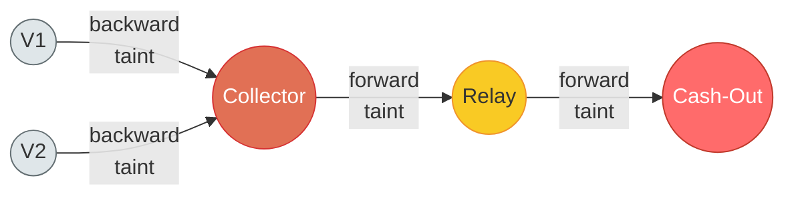
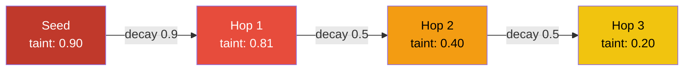
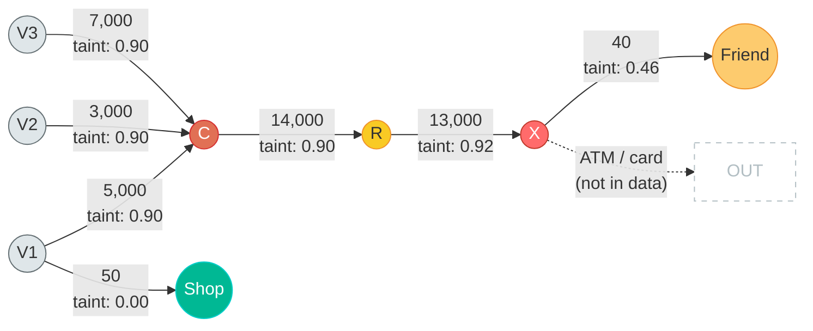
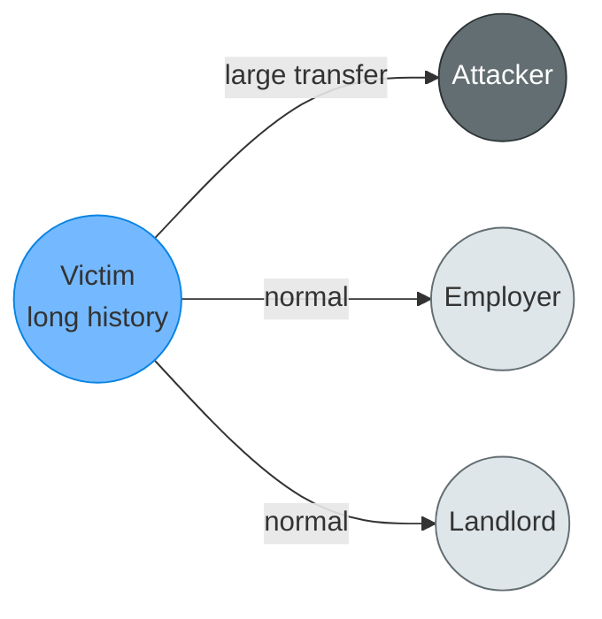

# Taint Propagation

## 1. What is Taint Propagation?

The three preceding documents describe how to find the bad actors in a transaction graph: cash-out endpoints that absorb stolen money, relays that shuttle it through the middle, and collectors that gather it from victims. Each detection method assigns a role and a confidence score to suspicious accounts.

But identifying the roles is only half the job. The goal is to classify *transactions*, not just accounts. A collector might have twenty inbound transactions -- some from victims, some legitimate. A relay might forward stolen money in one transaction and pay rent in another. Knowing that an account is a relay does not tell you which of its transactions are fraudulent.

Taint propagation solves this. It takes the fraud labels assigned to accounts (the "seeds") and spreads suspicion outward through their connections, assigning a taint score to every transaction in the graph.

**The analogy:** Drop a bead of ink into a glass of water. The ink spreads from the point of contact, coloring the water dark near the drop and progressively lighter as it diffuses outward. Eventually, at a certain distance from the drop, the water is effectively clear again.

Taint propagation works the same way. The ink is the fraud label. The water is the transaction graph. Transactions directly involving a detected fraudster are deeply colored (high taint). Transactions one hop away are moderately colored. Two or three hops out, the color fades to nothing.

**Why this matters:** Structural detection (docs 01-03) finds the skeleton of the fraud ring -- the key roles. Taint propagation fills in the flesh -- all the transactions that constitute the fraud, including victim payments, intermediary transfers, and extraction flows. It also catches things structural detection might miss: a relay that scored just below threshold but sits between two confirmed fraud nodes, or a victim whose payment to a collector was the only suspicious transaction in an otherwise clean history.

**This mirrors how investigations work in practice.** Law enforcement starts with a known criminal, maps their financial contacts, identifies which transactions are proceeds of crime, and follows the money both upstream (where did it come from?) and downstream (where did it go?). Taint propagation automates this investigative process.


## 2. Why Not Just Flag Everything Connected?

The naive approach is tempting: if account X is a confirmed fraudster, flag every transaction involving X, and every transaction involving X's counterparties, and every transaction involving *their* counterparties.

This does not work. It produces catastrophic false positives.

Consider a cash-out endpoint X that receives stolen money from relay R, but also buys groceries from a corner shop. Under the naive approach, the corner shop is now one hop from a fraudster, so its transactions get flagged. The shop's supplier is two hops away, so it gets flagged too. Within three hops, half the local economy is "suspicious."

Or consider a collector C that receives stolen money from victims V1, V2, V3. The victims are real people with real lives. V1 pays their landlord. V2 sends money to their mother. Under the naive approach, the landlord and the mother are flagged -- they are one hop from a fraud node.

The problem is that naive propagation treats all connections as equally meaningful. It ignores two critical distinctions:

**Direction matters.** Money flowing *into* a cash-out has a completely different meaning than money flowing *out* of one. Inbound to a cash-out is the fraud pipeline delivering stolen funds. Outbound from a cash-out is the fraudster spending their proceeds -- and the recipient (a grocery store, a gas station) is not complicit. Taint must be directional.

**Distance matters.** A direct counterparty of a confirmed fraudster is far more likely to be involved than an account two hops away. And an account three hops away is almost certainly uninvolved. Taint must decay with distance -- sharply enough that it does not reach innocent bystanders, but slowly enough that it catches the full extent of the fraud ring.


## 3. The Two Directions of Taint

Taint propagation runs in two distinct directions, each with its own semantics and decay profile.

---

### Forward Taint (Following the Money Downstream)

Forward taint starts at a collector or relay and traces where the money *went*. The question it answers: once stolen money entered the pipeline, what path did it take?

**Semantic meaning:** "This money is proceeds of crime."

Forward taint from a collector follows the money through the relay chain to the cash-out endpoint. Forward taint from a relay follows the money to the next relay and ultimately to the cash-out. Every transaction along this path is part of the fraud -- the money being moved IS the crime, regardless of how many hands it passes through.

**Decay is slow.** Because the money itself is stolen, it does not become "less stolen" as it moves through more accounts. A transfer from collector to relay is proceeds of crime. The same money forwarded from relay to cash-out is still proceeds of crime. The taint decays only slightly with each hop, reflecting a small decrease in confidence (maybe the relay also forwarded some legitimate money that got mixed in), but the signal stays strong.

Forward taint is the primary tool for mapping the complete fraud pipeline once any entry point is found.

---

### Backward Taint (Following the Money Upstream)

Backward taint starts at a collector and traces where the money *came from*. The question it answers: whose money was stolen?

**Semantic meaning:** "This money was stolen from these accounts."

Backward taint from a collector identifies the victim transactions -- the payments from real people whose money was siphoned into the fraud ring. These are the transactions where the crime *originated*.

**Decay must be sharp.** This is the critical distinction between forward and backward taint. When tracing backward from a collector:

- **Victim -> Collector transaction:** High taint. This is the stolen money.
- **Victim's other transactions:** No taint. The victim is a legitimate account. Their rent payment, their grocery purchase, their transfer to a family member -- none of these are fraudulent.
- **Victim's other counterparties:** No taint. The victim's landlord, employer, and grocery store are completely unrelated to the fraud.

Backward taint flags the *transaction*, not the *account*. The victim is not a bad actor -- they are the injured party. Only their specific transaction to the collector is tainted. This is a fundamental asymmetry: forward taint spreads broadly (the money is bad wherever it goes), but backward taint is surgically precise (only the stolen payment itself is bad).

If backward taint leaked beyond the specific victim-to-collector transaction, every victim's entire financial network would light up as suspicious. For a fraud ring with 50 victims, that could mean thousands of false positives -- landlords, employers, family members, all flagged because they happen to know someone whose account was compromised.

---

### Forward vs Backward Taint Direction



Forward taint (right arrows) follows the money downstream: where did the stolen funds go? Backward taint (left arrows) traces upstream: whose money was stolen? Forward taint decays slowly (the money is still stolen wherever it goes). Backward taint is surgically precise -- it flags only the specific victim-to-collector transaction, not the victim's other activity.

---

### Cross-Ring Taint

Cross-ring taint detects connections between separate fraud operations. If a confirmed relay in Ring A also transacts with a confirmed cash-out in Ring B, the two rings share infrastructure. This is common in organized crime: a money laundering network might service multiple fraud operations, reusing the same relay accounts or cash-out endpoints.

The mechanics are simple: for each detected fraud node, check whether any of its counterparties belong to a different detected ring. If so, the connecting transactions receive high taint regardless of hop distance -- an inter-ring connection is strong evidence of coordinated criminal activity.

Cross-ring taint is less relevant in small datasets (a 5,000-transaction dataset is unlikely to contain multiple independent fraud rings). But in production AML systems processing millions of transactions, cross-ring detection is how investigators uncover syndicated operations.


## 4. Taint Scores: How Much Suspicion to Assign

Every transaction in the graph receives a taint score between 0.0 (certainly clean) and 1.0 (certainly fraud). The score is determined by the transaction's relationship to detected fraud nodes.

---

### Direct Taint (Hop 0)

The seed accounts themselves -- confirmed cash-outs, relays, and collectors -- anchor the taint. Every transaction directly involving a seed account inherits taint from that seed's detection confidence score.

A cash-out detected with score 0.95 is near-certain. All of its transactions start with taint 0.95. A relay detected with score 0.65 is more uncertain. Its transactions start with taint 0.65.

This means the quality of upstream detection directly controls the quality of taint propagation. Taint propagation does not create confidence from nothing -- it *distributes* the confidence already established by the detection algorithms.

---

### First Hop Taint

Accounts one hop from a seed receive taint scaled by a decay factor. The decay factor depends on the nature of the relationship:

**Same-ring connection (decay = 0.9).** If both the seed and its neighbor are detected fraud roles -- for example, a relay forwarding to a confirmed cash-out -- the decay is minimal. Both accounts are part of the same operation, and the transaction between them is almost certainly part of the fraud. The 10% decay reflects only a slight possibility of coincidence.

**Unknown account sending to a cash-out (decay = 0.7).** If an undetected account sends money to a confirmed cash-out, it is probably a relay that was missed by structural detection. The 30% decay reflects uncertainty -- it could also be a legitimate payment if the cash-out account has some normal activity.

**Unknown account receiving from a collector (decay = 0.3).** If an undetected account receives money from a confirmed collector, it might be a downstream relay, or the collector might also be a real person who occasionally sends legitimate transfers. The steep 70% decay reflects this ambiguity. (Remember: backward taint for *victim* transactions is handled separately with its own scoring, so this case covers non-victim, non-ring outbound transactions from a collector.)

---

### Second Hop and Beyond

Each subsequent hop applies the same decay logic, compounding the reduction. By the second hop, taint has typically fallen below the decision threshold for most paths.

The purpose of second-hop taint is not to auto-flag transactions, but to identify borderline cases. An account two hops from a confirmed fraudster with taint 0.45 is not strong enough to flag automatically, but it is strong enough to warrant a closer look -- either by the LLM agent or by adjusted rule sensitivity.

Beyond the second hop, taint generally falls below 0.2 and provides no actionable signal. Setting a maximum propagation depth of 3 hops is sufficient for most fraud topologies and prevents runaway computation.



Taint decays with each hop. The color intensity represents confidence:
- **Red (> 0.7)**: auto-flag as FRAUD
- **Orange (0.4 - 0.7)**: AMBIGUOUS -- route to LLM
- **Yellow (0.2 - 0.4)**: low suspicion -- standard rules only
- **Clear (< 0.2)**: clean -- no action

By hop 2-3, taint has typically crossed below the fraud threshold. This natural decay prevents contamination of the legitimate economy.


## 5. The Decision Framework

After propagation completes, every transaction in the graph carries a taint score. These scores drive classification:

| Taint Score | Classification | Action |
|---|---|---|
| > 0.7 | FRAUD | Auto-flag. Intra-ring transfers, victim-to-collector payments. |
| 0.4 -- 0.7 | AMBIGUOUS | Route to LLM for contextual analysis. |
| 0.2 -- 0.4 | LOW SUSPICION | Apply standard transaction-level rules only. |
| < 0.2 | CLEAN | No structural fraud signal. Skip. |

The AMBIGUOUS zone (0.4 -- 0.7) is where the system earns its keep. These are the transactions that graph structure alone cannot resolve:

- A transaction from an undetected account to a low-confidence relay. Is the sender another relay, or a legitimate customer?
- A transaction from a confirmed collector to an account that is not part of any known ring. Is it a downstream relay, or the collector buying dinner?
- A transaction between two accounts that are each one hop from different fraud nodes. Coincidence, or a hidden connection?

These cases require the kind of contextual reasoning that an LLM excels at -- examining the transaction amount, timing, the account's broader history, and the narrative around why two accounts might be connected. The taint score gives the LLM a structured starting point and a clear question: "This transaction scored 0.55 for taint. Here is why. Is it fraud?"

### Threshold Tuning

The 0.7 and 0.4 cutoffs are starting points, not gospel.

- **Aggressive (maximize recall):** Lower the FRAUD threshold to 0.5. This catches more true fraud at the cost of more false positives in the auto-flag bucket. Useful when the priority is "do not miss any fraud" and false positives will be reviewed.
- **Conservative (maximize precision):** Raise the FRAUD threshold to 0.8. This auto-flags only the most certain cases, sending more to the LLM. Useful when false positives are expensive.

For the hackathon, start aggressive and tune against training data. Run taint propagation, compare the flagged transactions to the known labels, and adjust thresholds for the best F1 score.


## 6. Handling the Circular Dependency Problem

There is an inherent circularity in the detection pipeline:

- Cash-out detection uses relay scores (Fingerprint 3: are the sources suspicious relays?).
- Relay detection uses cash-out scores (Signature 4: are the downstream neighbors confirmed cash-outs?).
- Collector detection uses relay scores (Signature 2: does outbound flow go to relays?).

Each detector depends on scores produced by the others. If they all run simultaneously, they have no neighbor scores to reference. If they run sequentially, the first detector has no information about the roles it depends on.

### Solution: Iterative Convergence

The solution is borrowed from the same mathematics that powers PageRank: start with local-only estimates, then iteratively refine using neighbor information.

```
Iteration 0:
  Score all accounts using ONLY local features.
  - Cash-out: flow ratio, burst pattern, clustering coefficient
  - Relay: pass-through ratio, hold time, amount correlation
  - Collector: inbound diversity (strangers test), outbound concentration
  
  These scores are rough. Without neighbor information, a relay that
  feeds a confirmed cash-out looks the same as one that feeds a
  savings account. But the local features alone separate many cases.
  
  Result: initial_cash_out_scores, initial_relay_scores, initial_collector_scores
```

```
Iteration 1:
  Re-score all accounts, now using neighbor scores from iteration 0.
  - Cash-out: Fingerprint 3 can now check if sources have relay scores
  - Relay: Signature 4 can now check if downstream has cash-out scores
  - Collector: Signature 2 can now check if outbound goes to relays
  
  Scores shift. Some accounts gain confidence (their neighbors confirm
  the suspicion). Others lose it (their neighbors turned out clean).
  
  Result: updated_cash_out_scores, updated_relay_scores, updated_collector_scores
```

```
Iteration 2:
  Re-score again using updated neighbor scores from iteration 1.
  
  Convergence check: if the maximum score change across all accounts
  is less than 5% compared to iteration 1, STOP.
  
  The scores have stabilized -- further iterations will not meaningfully
  change them.
```

In practice, convergence happens in 2 to 3 iterations. The first iteration captures the dominant signals (a cash-out with a relay source, or vice versa). The second iteration propagates these refined scores one more hop. By the third iteration, the scores are stable.

This works in practice because the scoring space is small (5 binary signals per role) and the neighborhood influence is bounded. However, this is NOT mathematically equivalent to PageRank. PageRank has a proven convergence guarantee because it uses a damping factor and a stochastic matrix. Our scoring algorithm uses weighted boolean sums with multiplicative bonuses (1.1x, 1.15x, 1.3x), which has no formal convergence proof.

In theory, the multiplicative bonuses could cause oscillation: account A's bonus raises its score, which raises neighbor B's score, which further raises A's score. In practice, this is unlikely because the bonuses are small (10-30%) and the boolean signals don't change between iterations -- only the "suspicious neighbors" signal can flip based on neighbor scores. The "< 5% change" convergence check acts as a safety net: if scores haven't stabilized after 3 iterations, cap at the current values rather than continuing.

The analogy to PageRank captures the intuition (local information propagating through the graph) but overstates the mathematical rigor. For a 5,000-transaction hackathon dataset, pragmatic convergence is sufficient.


## 7. Technical Section: Taint Propagation Algorithm

```
TAINT PROPAGATION ALGORITHM

Input:
  G       -- transaction graph (nodes = accounts, edges = transactions)
  seeds   -- detected accounts with roles and scores:
               cash_outs  = {account_id: score}
               relays     = {account_id: score}
               collectors = {account_id: score}
  T       -- set of all transactions

Output:
  taint(t) for every transaction t in T


--- PHASE 1: Seed Taint ---

Initialize taint(t) = 0 for all t in T.

For each seed account A in (cash_outs UNION relays UNION collectors):
  role_score = score of A in its detected role
  For each transaction t where A is sender or receiver:
    
    // Direction-aware seeding: inbound and intra-ring transactions
    // inherit the full role score. Outbound to non-ring accounts
    // gets reduced taint (the fraudster spending, not the fraud itself).
    If t.receiver == A:
      // Money flowing INTO the seed (the fraud pipeline delivering)
      taint(t) = max(taint(t), role_score)
    Else if t.sender == A AND t.receiver is a detected role:
      // Intra-ring transfer (seed to another fraud node)
      taint(t) = max(taint(t), role_score)
    Else if t.sender == A AND t.receiver is NOT a detected role:
      // Seed spending at a clean account (e.g., cash-out transferring to a friend)
      taint(t) = max(taint(t), role_score * 0.5)


--- PHASE 2: Forward Propagation ---

Trace stolen money downstream: collectors --> relays --> cash-outs.

frontier = collectors UNION relays
visited = empty set
hop = 0

While frontier is not empty AND hop < MAX_HOPS (typically 3):
  next_frontier = empty map

  For each account A in frontier:
    For each outbound transaction t from A to some account B:
      If B not in visited:
        
        // Determine decay based on B's status
        If B is a detected role (relay or cash-out):
          decay = 0.9      // same ring, minimal decay
        Else:
          decay = 0.5      // unknown account, moderate decay
        
        taint_B = taint_of(A) * decay
        taint(t) = max(taint(t), taint_B)
        
        next_frontier[B] = max(next_frontier[B], taint_B)

  visited = visited UNION keys(frontier)
  frontier = next_frontier
  hop = hop + 1


--- PHASE 3: Backward Propagation ---

Trace stolen money upstream: collectors <-- victims.

For each collector C in collectors:
  For each inbound transaction t from some account V to C:
    If V is NOT a detected role:
      // V is likely a victim. Taint the specific transaction.
      taint(t) = max(taint(t), score(C) * 0.8)
      
      // CRITICAL: do NOT taint V's other transactions.
      // V is a legitimate account. Only their payment to C is fraud.


--- PHASE 4: Cross-Ring Detection ---

all_ring_members = cash_outs UNION relays UNION collectors

For each member M in all_ring_members:
  ring_M = the ring that M belongs to
  For each neighbor N of M:
    If N is in all_ring_members AND ring(N) != ring(M):
      // Two separate rings share a connection
      For each transaction t between M and N:
        taint(t) = max(taint(t), 0.9)


--- CLASSIFICATION ---

For each transaction t in T:
  If taint(t) > 0.7:       FLAG AS FRAUD
  If 0.4 <= taint(t) <= 0.7: ROUTE TO LLM
  If taint(t) < 0.4:       APPLY STANDARD RULES
```

### Complexity

The algorithm is pure graph traversal. Phase 1 iterates over seed accounts and their transactions: O(|seeds| * average_degree). Phases 2 and 3 are bounded BFS traversals limited to MAX_HOPS: O(|V| + |E|) in the worst case, but typically much smaller because the frontier shrinks rapidly as taint decays below threshold. Phase 4 iterates over ring members and their neighbors: O(|ring| * average_degree).

For a 5,000-transaction dataset, the entire algorithm runs in single-digit milliseconds. Zero LLM tokens consumed.


## 8. Worked Example

Consider a small fraud ring:

```
Accounts:
  V1, V2, V3   -- victims (real people whose money was stolen)
  C             -- collector (gathers victim payments)
  R             -- relay (forwards money to obscure the trail)
  X             -- cash-out (extracts the money)
  Shop          -- a grocery store (legitimate account, receives V1's normal transfer)
  F             -- a friend of X (legitimate account, receives a small transfer from X)

Transactions:
  V1 --> C:     5,000     victim payment
  V2 --> C:     3,000     victim payment
  V3 --> C:     7,000     victim payment
  C  --> R:    14,000     collector forwards (kept 1,000 as fee)
  R  --> X:    13,000     relay forwards (kept 1,000 as fee)
  V1 --> Shop:     50     victim sends money to a shop (normal life)
  X  --> F:        40     cash-out sends money to a friend (incidental transfer)
```

Note: the cash-out's main extraction (ATM withdrawal, card spending, crypto) is invisible in an account-to-account transfer dataset. The X --> F transfer is a minor account-to-account transfer the fraudster happens to make -- not the primary extraction channel.



The complete fraud ring visualized. Red/orange nodes are detected fraud roles. Gray nodes are victims. Green is a clean counterparty. The dashed exit from X shows the primary extraction channel (ATM/card/crypto) that is invisible in the dataset -- this is why X appears absorptive. The X --> Friend edge (taint 0.46) is an incidental account-to-account transfer that lands in the ambiguous zone. V1's payment to the Shop (taint 0.00) is untouched -- backward taint flags only the specific stolen transaction (V1 to C), not the victim's entire financial life.

### Step 1: Structural Detection

The three detection algorithms run first (with iterative convergence):

- **Cash-out detection** finds X. It is absorptive (receives 13,000, sends only 40 via account transfer -- the rest extracted via invisible channels), has one concentrated source (R), shows burst activity, and has no community embedding. Score: 0.92.
- **Relay detection** finds R. It has pass-through flow (receives 14,000, sends 13,000), short hold time, correlated inbound/outbound amounts, and its downstream neighbor X is a confirmed cash-out. Score: 0.85.
- **Collector detection** finds C. Three unrelated strangers (V1, V2, V3) send money to it, and its outbound goes entirely to a confirmed relay. Score: 0.90.

### Step 2: Taint Propagation

**Phase 1 -- Seed Taint.** All transactions directly involving C, R, or X receive direction-aware taint:

| Transaction | Seed | Direction | Direct Taint |
|---|---|---|---|
| V1 --> C | C (0.90) | inbound to seed | 0.90 |
| V2 --> C | C (0.90) | inbound to seed | 0.90 |
| V3 --> C | C (0.90) | inbound to seed | 0.90 |
| C --> R | C (0.90), R (0.85) | intra-ring | 0.90 (max) |
| R --> X | R (0.85), X (0.92) | intra-ring | 0.92 (max) |
| X --> F | X (0.92) | outbound to clean | 0.92 * 0.5 = 0.46 |
| V1 --> Shop | (none) | no seed involved | 0.00 |

Notice X --> F gets 0.46, not 0.92. The direction-aware seeding recognizes that a cash-out sending money to a friend is the fraudster making an incidental transfer, not the fraud pipeline itself. This prevents innocent counterparties from being auto-flagged.

**Phase 2 -- Forward Propagation.** Starting from collectors and relays, trace outbound:

- C --> R: already tainted at 0.90. R is a detected role, so decay = 0.9. Taint from forward propagation = 0.90 * 0.9 = 0.81. Already has 0.90 from Phase 1, stays at 0.90.
- R --> X: similar logic. Forward taint = 0.85 * 0.9 = 0.765. Already has 0.92 from Phase 1. Stays at 0.92.
- X --> F: forward from X. F is not a detected role, so decay = 0.5. Forward taint = 0.92 * 0.5 = 0.46. Already has 0.46 from Phase 1. No change.

**Phase 3 -- Backward Propagation.** From collector C, trace inbound:

- V1 --> C: V1 is not a detected role. Taint = score(C) * 0.8 = 0.90 * 0.8 = 0.72. Current taint is 0.90 from Phase 1 (C is a seed). Stays at 0.90.
- V2 --> C: same logic. Stays at 0.90.
- V3 --> C: same logic. Stays at 0.90.
- V1 --> Shop: V1's OTHER transaction. NOT tainted by backward propagation. Stays at 0.00.

This is the critical result of backward taint: V1's payment to C is flagged as fraud (0.90), but V1's grocery purchase is clean (0.00). The victim's legitimate transactions are untouched.

**Phase 4 -- Cross-Ring.** Only one ring exists in this example. No cross-ring connections. No changes.

### Step 3: Final Classification

| Transaction | Final Taint | Classification |
|---|---|---|
| V1 --> C: 5,000 | 0.90 | FRAUD |
| V2 --> C: 3,000 | 0.90 | FRAUD |
| V3 --> C: 7,000 | 0.90 | FRAUD |
| C --> R: 14,000 | 0.90 | FRAUD |
| R --> X: 13,000 | 0.92 | FRAUD |
| X --> F: 40 | 0.46 | AMBIGUOUS (LLM review) |
| V1 --> Shop: 50 | 0.00 | CLEAN |

Five transactions auto-flagged as fraud. One sent to the LLM for analysis (the cash-out's transfer to a friend -- probably not fraud, but the LLM can confirm). One confirmed clean.

The three victim payments are correctly identified as stolen money. The full pipeline (C --> R --> X) is correctly mapped. And V1's grocery purchase is left alone -- the victim is not penalized for being victimized.


## 9. Practical Considerations for the Hackathon

### Computation Cost

Taint propagation is pure graph traversal. It consumes zero LLM tokens. The entire algorithm -- iterative convergence of detection scores, four-phase taint propagation, and transaction classification -- runs in milliseconds on a 5,000-transaction dataset. This means we can run it many times with different parameters, thresholds, and decay factors without incurring any API cost.

### The LLM Sees Only the Boundary

The AMBIGUOUS zone (taint 0.4 -- 0.7) is where LLM analysis is needed. In the worked example, only one transaction out of seven landed in this zone. In a real dataset, the ratio will be similar -- most transactions will be clearly clean or clearly fraud, with a small ambiguous boundary.

This is the core efficiency of the fraudster-first approach: structural detection and taint propagation handle the bulk of classification mechanically, and the LLM's expensive contextual reasoning is reserved for the genuinely hard cases at the boundary.

### Threshold Tuning on Training Data

The optimal thresholds depend on the dataset:

1. Run the full pipeline (detection + taint propagation) on the training data.
2. Compare taint-based classifications to the known labels.
3. Compute precision, recall, and F1 at different threshold values (0.5, 0.6, 0.7, 0.8).
4. Pick the thresholds that maximize F1, or that achieve the recall/precision tradeoff the judges prefer.

### When Taint Propagation Finds Nothing

If the dataset contains no ring structure -- if all fraud is isolated (card fraud, account takeover with no downstream pipeline) -- taint propagation returns zero flags. This is correct behavior, not a failure. The standard transaction-level rules handle isolated fraud. Taint propagation is additive: it catches ring-structured fraud that transaction-level rules miss, and it stays silent when there are no rings to find.

The pipeline degrades gracefully. If cash-out detection finds nothing, there are no seeds to propagate from, and the system falls back entirely to rule-based classification. Nothing breaks.

### The Account Takeover Blind Spot (Critical Limitation)

The fraudster-first pipeline is designed for organized, multi-account fraud (rings, mule networks, money laundering). But a large category of fraud -- potentially 50%+ of cases in some datasets -- does not involve rings at all.

**Account takeover (ATO)** is the most common example. A legitimate account is compromised, drained in 1-2 transactions, and the money goes directly to the attacker's account. The structure looks like:

```
Victim (long history, compromised) --> Attacker (receives from 1 victim)
```



Account takeover: a legitimate account (blue) is compromised and sends a large, anomalous transfer to the attacker (dark gray). There is no ring structure -- no collector, no relay, no cash-out pattern. The attacker has only one inbound source, so the strangers test doesn't fire. This is the pipeline's blind spot: ATO fraud must be caught by transaction-level behavioral rules (velocity, amount anomaly, new payee), not by graph-structural detection.

This evades every detector in the pipeline:
- The attacker doesn't score as a **collector** (only 1 sender -- the strangers test needs >= 3).
- The attacker doesn't score as a **relay** (no forwarding -- money stays).
- The attacker may not score as a **cash-out** (with only 1 inbound source, Fingerprint 2 fires but Fingerprint 3 fails because we can't assess "source quality" from a single source).
- There is no ring, so **taint propagation** finds no seeds to propagate from.

**Why this matters for the hackathon:** If the dataset is dominated by ATO fraud (which is common in retail banking datasets), this entire pipeline finds nothing, and all detection falls to the standard transaction-level rules. The fraudster-first approach is not wrong -- it just doesn't cover this fraud type.

**Mitigations:**
- The existing transaction-level rules (velocity checks, amount anomaly, dormant reactivation, new payee, impossible travel) catch ATO effectively because ATO manifests as sudden behavioral deviation from the victim's baseline.
- Consider a hybrid: run the fraudster-first pipeline for ring detection AND the standard rules for ATO detection. They cover complementary fraud types.
- A lightweight ATO-specific detector: flag transactions where (a) the sender is an established account, (b) the amount is > 2 standard deviations above their mean, (c) the recipient is a new counterparty, and (d) it's the sender's first or second transaction to this recipient. This catches the "compromised account drained to an unfamiliar destination" pattern without needing ring structure.


## 10. Summary: The Complete Fraudster-First Pipeline

The four documents describe a complete detection pipeline, each building on the previous:

```
Step 1: Cash-Out Detection (doc 01)
  Find where stolen money lands.
  Signals: absorptive flow, concentrated sources, suspicious
  sources, burst activity, no community embedding.
  Output: cash_out accounts with confidence scores.

Step 2: Relay Detection (doc 02)
  Find the middlemen who forward money.
  Signals: pass-through flow, short hold time, correlated
  amounts, suspicious downstream neighbors.
  Output: relay accounts with confidence scores.

Step 3: Collector Detection (doc 03)
  Find where victims' money enters the pipeline.
  Signals: diverse unrelated inbound (strangers test),
  outbound concentration to relays, victim-like inbound pattern.
  Output: collector accounts with confidence scores.

Step 4: Taint Propagation (this doc)
  Spread fraud labels through the graph to classify transactions.
  Forward taint: follow the money downstream through the pipeline.
  Backward taint: identify victim transactions surgically.
  Cross-ring taint: detect shared infrastructure between rings.
  Output: taint score for every transaction.
```

The total LLM cost of Steps 1 through 4 is zero. Every computation is graph traversal, arithmetic, and threshold comparison. The LLM budget is entirely preserved for the transactions that land in the ambiguous zone -- the genuinely hard cases where structural signals are inconclusive and contextual reasoning is needed to make the call.
