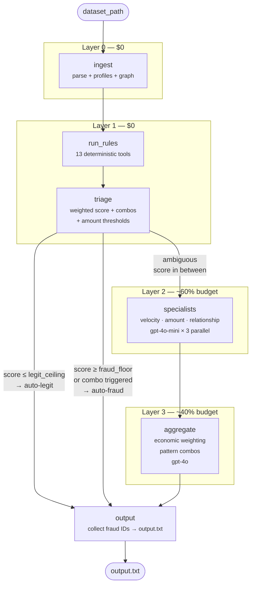

# pipeline/ — LangGraph State Machine

Wires all layers into a compiled `StateGraph`. Entry point: `build_pipeline()`.

## Graph



## Modules

| File | Responsibility |
|---|---|
| `state.py` | `PipelineState` TypedDict — all data flowing through the graph |
| `dispatch.py` | `_TOOL_CONTEXT` mapping + `invoke_tool()` — routes context to rule tools |
| `nodes.py` | All node functions: `ingest`, `run_rules`, `triage`, `run_specialists`, `aggregate`, `collect_output` |
| `graph.py` | `build_pipeline()` — wires nodes + edges into compiled `StateGraph` |

## State Shape

```python
class PipelineState(TypedDict, total=False):
    dataset_path: str
    transactions: list[dict]
    profiles: dict                    # account_id → AccountProfile
    graph: dict                       # relationship graph
    rule_results: dict                # txn_id → [(tool_name, RiskResult)]
    auto_legit: list[str]             # txn IDs — skip LLM
    auto_fraud: list[str]             # txn IDs — skip LLM
    ambiguous: list[str]              # txn IDs → Layer 2
    specialist_results: dict          # txn_id → [specialist outputs]
    verdicts: dict                    # txn_id → {is_fraud, confidence, reasoning}
    fraud_ids: list[str]              # final output
```

## Routing Logic

`triage` → conditional edge (`should_run_specialists`):
- **Has ambiguous txns** → `specialists` → `aggregate` → `output`
- **No ambiguous txns** → `output` (skip LLM layers, save entire budget)

## Token Budget

| Layer | Txns | Tokens/txn | Model | Est. cost |
|---|---|---|---|---|
| 0 + 1 | all | 0 | — | $0 |
| 2 (specialists) | ~15-30% of total | ~300 × 3 | gpt-4o-mini | ~$6–8 |
| 3 (aggregator) | ~15-30% of total | ~800 | gpt-4o | ~$8–12 |
| **Total** | | | | **~$14–20** per dataset |

Safety valve: tighten Layer 1 thresholds → fewer txns reach Layer 2 → lower cost.
