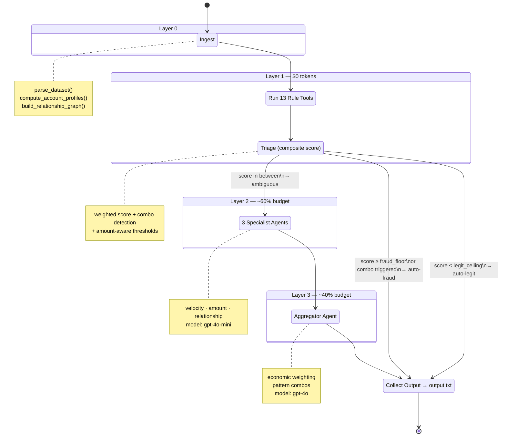

# Pipeline Graph

## Nodes

| Node | Module | Layer | Tokens |
|---|---|---|---|
| `ingest` | `pipeline/nodes.py` → `data/` | 0 | $0 |
| `run_rules` | `pipeline/nodes.py` → `rules/` | 1 | $0 |
| `triage` | `pipeline/nodes.py` → `rules.compute_composite_risk` | 1 | $0 |
| `specialists` | `pipeline/nodes.py` (TODO) | 2 | ~$6–8 |
| `aggregate` | `pipeline/nodes.py` (TODO) | 3 | ~$8–12 |
| `output` | `pipeline/nodes.py` | — | $0 |

## Routing

`triage` → conditional edge:
- **Has ambiguous txns** → `specialists` → `aggregate` → `output`
- **No ambiguous txns** → `output` (skip LLM layers entirely)
