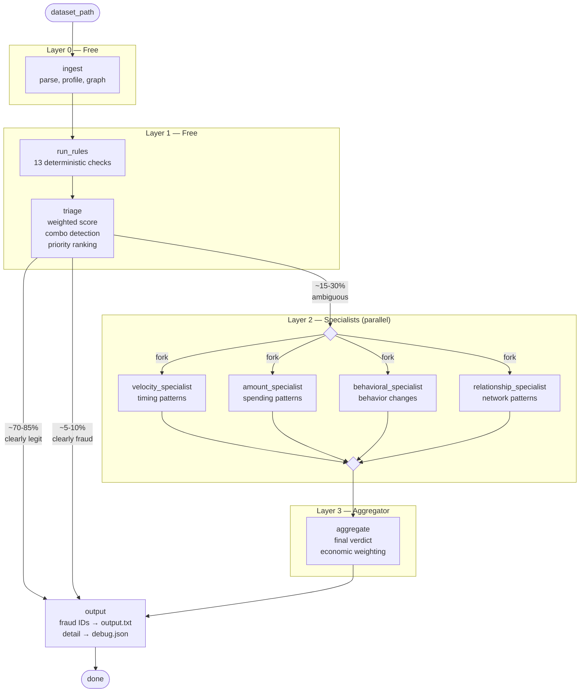

# pipeline/ — The Assembly Line

Think of this as a factory assembly line. A transaction enters raw, passes through
increasingly expensive quality checks, and exits with a verdict.

**The key insight**: most transactions are obviously legit. We use cheap filters first
to avoid wasting expensive LLM calls on boring data.

## How It Flows



## What Each Step Does

### Layer 0 — Ingest ($0)
Read the dataset directory: parse transactions, compute account stats, build
the relationship graph, and load multi-modal citizen data (demographics,
location history, health status, persona descriptions). Accepts either a
directory path (scans for transactions + supplementary files) or a single
file path (backward compatible).

**Status**: Implemented.

### Layer 1 — Rules ($0)
Run 13 fast checks per transaction. Each check says "high / medium / low risk."
Combine them into a weighted composite score with combo detection. Then triage:

1. **Combo triggered** → auto-fraud (known dangerous pattern, skip LLM)
2. **Score >= fraud_floor** → auto-fraud
3. **Score <= legit_ceiling** → auto-legit
4. **Else** → ambiguous

Ambiguous transactions get ranked by `score × amount` descending. This is an
**expected-value heuristic** — a mediocre-risk €50k transaction deserves more
scrutiny than a high-risk €5 one. We estimate budget for the top-N ambiguous
transactions and send those to specialists. The rest get a rule-based fallback
verdict.

**Why score × amount?** It's a proxy for expected loss. A transaction with
risk score 3.0 and amount €50,000 has priority 150,000 — far higher than a
score 8.0 on a €10 transaction (priority 80). This ensures the LLM budget
goes where the financial stakes are highest.

**Status**: Implemented (triage priority ranking is a stub).

### Layer 2 — Specialists (~60% of budget)
Four LLM agents examine the ambiguous transactions from different angles — in
parallel. Parallel execution means total latency = slowest specialist, not the
sum of all four.

| Specialist | Angle | Example signals |
|---|---|---|
| `velocity_specialist` | Timing patterns | Burst of transactions, unusual hours |
| `amount_specialist` | Spending patterns | Round numbers, amount anomalies |
| `behavioral_specialist` | Behavior changes | New payees, dormant reactivation, frequency shifts |
| `relationship_specialist` | Network patterns | Fan-in/fan-out, mule chains |

Each specialist receives the same set of ambiguous transactions but analyzes
from its own domain. They return structured results with risk level, confidence,
detected patterns, and reasoning.

**Parallelism** uses LangGraph's `Send` API — triage emits four `Send()`
objects, one per specialist node. LangGraph schedules them concurrently and
waits for all four to complete before moving to the aggregate node. The
`specialist_results` state key uses a dict-merge reducer so each branch's
output merges into a single dict.

**Error handling** is amount-aware:
- Transaction > €1k and specialist fails → retry once
- Transaction ≤ €1k and specialist fails → skip that specialist, aggregate with remaining
- All 4 fail → fallback to rule-based verdict

**Status**: Implemented.

### Layer 3 — Aggregator (~40% of budget)
Combines the four specialist opinions into a final fraud/legit verdict. Weighs
the transaction amount: a €50k transaction with medium suspicion gets flagged;
a €50 transaction needs overwhelming evidence.

**Status**: Implemented.

### Output
Produces two files:
- **output.txt** — fraud IDs only (submission format)
- **debug.json** — full per-transaction detail for tuning between datasets

**Status**: Implemented.

## The Budget Trick

This funnel design is how we stay within $40 for 3,000 transactions:

```
3,000 txns → Layer 0+1 (free) → ~500 ambiguous → prioritize top-N → Layer 2+3
```

A `BudgetTracker` lives in pipeline state and monitors spend in real-time:
- **Normal**: process ambiguous txns in priority order until budget runs low
- **Low budget**: process fewer ambiguous txns, rest get rule-based fallback
- **Panic** (< 15% remaining): skip Layer 2+3 entirely, all verdicts are rule-based

## Debug JSON Structure

Each transaction gets a full trace for offline tuning:

```json
{
  "txn_id": "...",
  "amount": 50000,
  "priority_rank": 3,
  "layer1": {
    "composite_score": 4.5,
    "tool_results": [["check_velocity", {"risk": "high", "reason": "..."}], ...],
    "combo_triggered": null,
    "triage_decision": "ambiguous"
  },
  "layer2": {
    "velocity": {"risk_level": "high", "confidence": 0.85, "patterns": ["BURST"], "reasoning": "..."},
    "amount": {"risk_level": "medium", "confidence": 0.6, "patterns": ["ROUND_NUMBER"], "reasoning": "..."},
    "behavioral": {"risk_level": "high", "confidence": 0.78, "patterns": ["DORMANT_REACTIVATION"], "reasoning": "..."},
    "relationship": {"risk_level": "low", "confidence": 0.3, "patterns": [], "reasoning": "..."}
  },
  "layer3": {"is_fraud": true, "confidence": 0.82, "reasoning": "..."},
  "final_verdict": "fraud",
  "verdict_source": "specialist"
}
```

`verdict_source` is one of: `"auto_rule"`, `"specialist"`, `"budget_fallback"`.

## Langfuse Tracing

Every LLM `.invoke()` call receives a Langfuse callback handler and
`langfuse_session_id` in its metadata config. Session IDs are generated by
`config/tracing.py` in the format `{team}-{ULID}`. The Langfuse client is
flushed at exit in `main.py` to ensure all traces land before the process ends.

## Files

| File | What it does |
|---|---|
| `state.py` | `PipelineState` TypedDict — the data shape flowing through the pipeline (includes citizens) |
| `dispatch.py` | Maps each rule tool to its required context keys, routes invocations |
| `nodes.py` | All node functions: ingest, run_rules, triage, 4 specialists, aggregate, output |
| `graph.py` | Wires the nodes into a LangGraph state machine with `Send` fan-out/fan-in |
