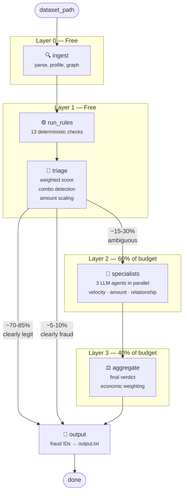

# pipeline/ — The Assembly Line

Think of this as a factory assembly line. A transaction enters raw, passes through
increasingly expensive quality checks, and exits with a verdict.

**The key insight**: most transactions are obviously legit. We use cheap filters first
to avoid wasting expensive LLM calls on boring data.

## How It Flows



## What Each Step Does

**Layer 0 — Ingest** ($0): Read the dataset, compute stats for every account
(average spending, who they send to), and build a "who-transacts-with-whom" graph.

**Layer 1 — Rules** ($0): Run 13 fast checks per transaction. Each check says
"high / medium / low risk." Combine them into a weighted score. If the score is
obviously legit or obviously fraud → skip the LLM entirely. Only the ambiguous
middle band goes forward.

**Layer 2 — Specialists** (~$6-8): Three LLM agents look at the ambiguous
transaction from different angles — timing patterns, amount patterns, and
relationship patterns. They run in parallel.

**Layer 3 — Aggregator** (~$8-12): A more capable LLM combines the three
specialist opinions into a final yes/no fraud verdict. It weighs the transaction
amount: a €50k transaction with medium suspicion gets flagged; a €50 transaction
needs overwhelming evidence.

## The Budget Trick

This funnel design is how we stay within $40 for 3,000 transactions:

```
3,000 txns → Layer 0+1 (free) → ~500 ambiguous → Layer 2+3 (~$16)
```

If budget runs low, we tighten Layer 1 thresholds → fewer txns reach Layer 2.
Worst case ("budget panic"): skip LLM entirely, use only rule-based verdicts.

## Files

| File | What it does |
|---|---|
| `state.py` | Defines the data shape flowing through the pipeline |
| `dispatch.py` | Knows which context each rule tool needs, routes it correctly |
| `nodes.py` | The actual functions: ingest, run_rules, triage, specialists, aggregate, output |
| `graph.py` | Wires the functions into a LangGraph state machine |
