# rules/ — The Alarm System

These are 14 fast, cheap alarms across 5 categories. Like a building's fire
detection system: smoke detectors, heat sensors, motion detectors. Each one is
simple and sometimes wrong alone, but together they paint a picture.

**Cost**: $0 — pure Python, no LLM calls.

## The Five Questions

Every rule answers one of five questions about a transaction:

### 1. "Is the timing suspicious?" → `time.py`

Fraudsters race the clock. They drain accounts in minutes, often at 3am when
the real owner is asleep.

- **`check_velocity`** — Are transactions happening unusually fast? (< 60s gap = alarm)
- **`check_temporal_pattern`** — Is this happening at 3am? (00:00–05:00 UTC)
- **`check_card_testing`** — Did tiny test transactions (€0.50, €1, €2) happen right before this big one?

### 2. "Is the amount suspicious?" → `amount.py`

Fraudsters either go all-in (drain the account) or carefully stay below reporting
thresholds (€4,999 instead of €5,000).

- **`check_amount_anomaly`** — Is this amount wildly different from this account's history? Is it a suspiciously round number?
- **`check_balance_drain`** — Is this transaction wiping out the account? (>90% of balance)
- **`check_first_large`** — Has this account *never* sent this much before?

### 3a. "Is the behavior suspicious?" → `behavioral.py`

Account-level patterns that don't fit the profile.

- **`check_new_payee`** — Sending a lot of money to someone you've never transacted with
- **`check_dormant_reactivation`** — Account was dead for 6 months, suddenly active with big amounts
- **`check_frequency_shift`** — Normally 2 txns/week, suddenly 30 in one day

### 3b. "Is the network suspicious?" → `graph.py`

The most powerful signals. Individual transactions look clean, but the *network*
reveals the scheme.

- **`check_fan_in`** — Many accounts sending to one "collector" account (mule aggregation)
- **`check_fan_out`** — One account distributing to many recipients (mule payout)
- **`check_mule_chain`** — Money hops A→B→C within minutes (laundering chain)
- **`check_circular_flow`** — Money loops back to where it started (wash trading)

### 4. "Is the location plausible?" --> `geographic.py`

Cross-references transaction location with the citizen's known home and travel
history. A transaction from Tokyo by a homebound retiree in Detroit is
physically implausible.

- **`check_impossible_travel`** — Is this transaction from a location the citizen has never visited and couldn't plausibly reach? Compares haversine distance from home to the transaction's lat/lng against the citizen's max known travel distance.

## How Alarms Combine

Each alarm says HIGH (3 pts), MEDIUM (1 pt), or LOW (0 pts).
But not all alarms are equal:

| Alarm type | Weight | Why |
|---|---|---|
| Off-hours | 0.5x | Lots of innocent reasons to transact at night |
| Standard signals | 1.0x | Baseline |
| Drain / card testing | 1.5x | Strong behavioral indicators |
| **Graph patterns** | **2.0x** | **Hardest to fake, most indicative of organized fraud** |
| **Geographic** | **2.0x** | **Physical implausibility is hard to explain away** |

### Auto-Pilot Decisions

Some combinations are so clear that we skip the LLM entirely:

**Always fraud** (combo triggered):
- Burst + Balance drain (account being emptied fast)
- New payee + Suspicious amount (sending a weird amount to a stranger)
- Mule chain + Structuring (laundering + hiding from reporting)
- Impossible travel + Balance drain (draining from an implausible location)

**Depends on how much money is involved**:

| Amount | "Clearly legit" if score ≤ | "Clearly fraud" if score ≥ |
|---|---|---|
| > €10,000 | 0 (almost nothing is safe) | 4 |
| €1k–€10k | 1 | 5 |
| €100–€1k | 1 | 6 |
| < €100 | 2 (most things are fine) | 8 (need overwhelming evidence) |

Everything in between → ambiguous → goes to the LLM specialists.

## Threshold Tuning Guide

Every magic number in the rules lives in one place: `_types.py`. On hackathon day,
open that file, look at the data distribution, adjust the numbers. No other file
needs to change — every tool reads its thresholds from there.

### Time thresholds

| Constant | Default | Controls | Used by |
|---|---|---|---|
| `VELOCITY_HIGH_GAP` | 60 | Avg gap (seconds) between recent txns → HIGH | `check_velocity` |
| `VELOCITY_MEDIUM_GAP` | 300 | Avg gap (seconds) → MEDIUM | `check_velocity` |
| `OFF_HOURS_START` | 0 | Start of suspicious window (UTC hour) | `check_temporal_pattern` |
| `OFF_HOURS_END` | 5 | End of suspicious window (UTC hour) | `check_temporal_pattern` |
| `CARD_TEST_MICRO_LIMIT` | 10 | Max amount (€) to count as a "micro" test txn | `check_card_testing` |
| `CARD_TEST_LARGE_LIMIT` | 500 | Min amount (€) for the "real" txn after tests | `check_card_testing` |
| `CARD_TEST_WINDOW` | 300 | Lookback window (seconds) for micro-txns | `check_card_testing` |
| `CARD_TEST_HIGH_COUNT` | 3 | Micro-txn count in window → HIGH | `check_card_testing` |

### Amount thresholds

| Constant | Default | Controls | Used by |
|---|---|---|---|
| `OUTLIER_SIGMA` | 3 | Standard deviations above mean → HIGH | `check_amount_anomaly` |
| `ROUND_NUMBER_MIN` | 1000 | Min round amount (€) that looks suspicious | `check_amount_anomaly` |
| `STRUCTURING_PROXIMITY` | 200 | € below a reporting limit to flag as structuring | `check_amount_anomaly` |
| `DRAIN_HIGH` | 0.9 | Balance fraction drained → HIGH | `check_balance_drain` |
| `DRAIN_MEDIUM` | 0.7 | Balance fraction drained → MEDIUM | `check_balance_drain` |
| `FIRST_LARGE_HIGH` | 5 | Multiple of max historical amount → HIGH | `check_first_large` |
| `FIRST_LARGE_MEDIUM` | 3 | Multiple of max historical amount → MEDIUM | `check_first_large` |
| `FIRST_LARGE_MIN_TXNS` | 5 | Min historical txns before HIGH can trigger | `check_first_large` |

### Behavioral thresholds

| Constant | Default | Controls | Used by |
|---|---|---|---|
| `NEW_PAYEE_HIGH_AMOUNT` | 1000 | Amount (€) to unknown payee → HIGH | `check_new_payee` |
| `NEW_PAYEE_MEDIUM_AMOUNT` | 200 | Amount (€) to unknown payee → MEDIUM | `check_new_payee` |
| `DORMANT_HIGH_DAYS` | 180 | Days inactive → HIGH (if amount > avg) | `check_dormant_reactivation` |
| `DORMANT_MEDIUM_DAYS` | 90 | Days inactive → MEDIUM | `check_dormant_reactivation` |
| `FREQUENCY_SHIFT_HIGH` | 10 | Rate multiplier vs. baseline → HIGH | `check_frequency_shift` |
| `FREQUENCY_SHIFT_MEDIUM` | 5 | Rate multiplier vs. baseline → MEDIUM | `check_frequency_shift` |

### Graph thresholds

| Constant | Default | Controls | Used by |
|---|---|---|---|
| `FAN_IN_HIGH` | 10 | In-degree (distinct senders) → HIGH | `check_fan_in` |
| `FAN_IN_MEDIUM` | 5 | In-degree → MEDIUM | `check_fan_in` |
| `FAN_OUT_HIGH` | 10 | Out-degree (distinct receivers in 24h) → HIGH | `check_fan_out` |
| `FAN_OUT_MEDIUM` | 5 | Out-degree → MEDIUM | `check_fan_out` |
| `MULE_FORWARD_HIGH` | 0.7 | Fraction of received amount forwarded → HIGH | `check_mule_chain` |
| `MULE_FORWARD_MEDIUM` | 0.5 | Fraction forwarded → MEDIUM | `check_mule_chain` |
| `MULE_WINDOW_HIGH` | 1800 | Forward window (seconds, 30 min) → HIGH | `check_mule_chain` |
| `MULE_WINDOW_MEDIUM` | 7200 | Forward window (seconds, 2h) → MEDIUM | `check_mule_chain` |
| `CIRCULAR_MAX_HOPS` | 3 | Max hops to detect circular flow → HIGH | `check_circular_flow` |

### Geographic thresholds

| Constant | Default | Controls | Used by |
|---|---|---|---|
| `IMPOSSIBLE_TRAVEL_DISTANCE_HIGH` | 5000 | km from home → HIGH (if also > known max × 1.5) | `check_impossible_travel` |
| `IMPOSSIBLE_TRAVEL_DISTANCE_MEDIUM` | 2000 | km from home → MEDIUM | `check_impossible_travel` |

---

## Decision Flowcharts

Visual reference for every rule's decision logic. Each node shows the exact
threshold from `_types.py` and the resulting risk level with its point value.

### 1. Time-Based Rules

#### `check_velocity` (weight: 1.0x)

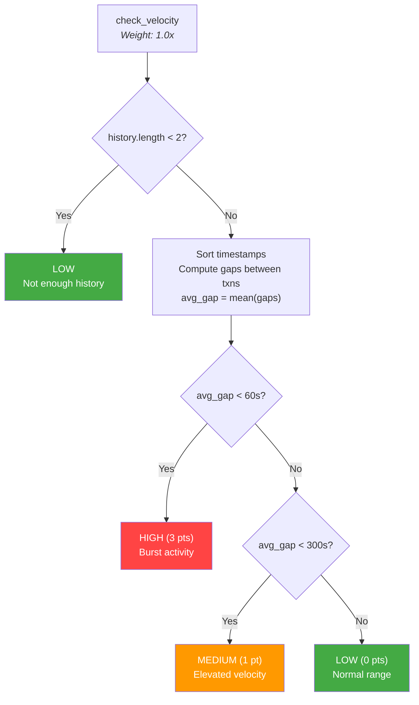

#### `check_temporal_pattern` (weight: 0.5x)

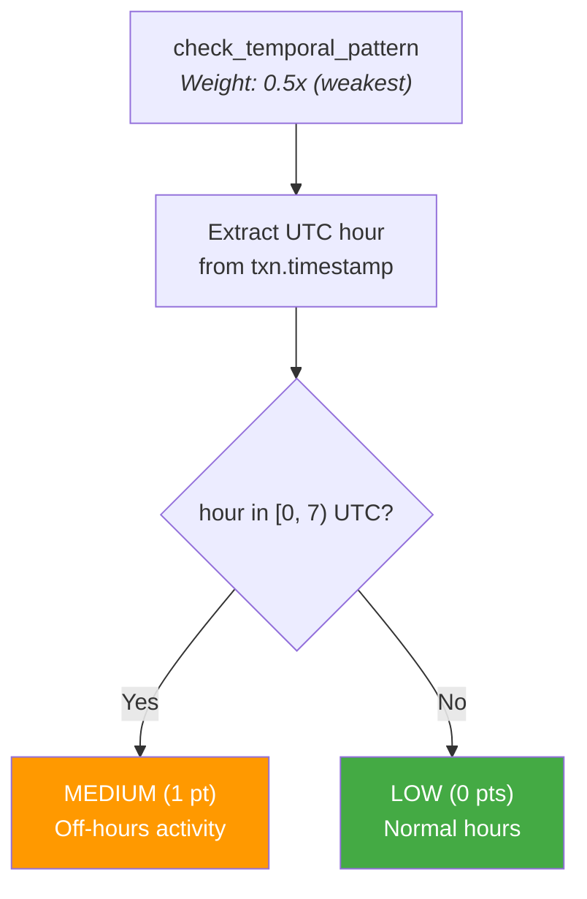

#### `check_card_testing` (weight: 1.5x)

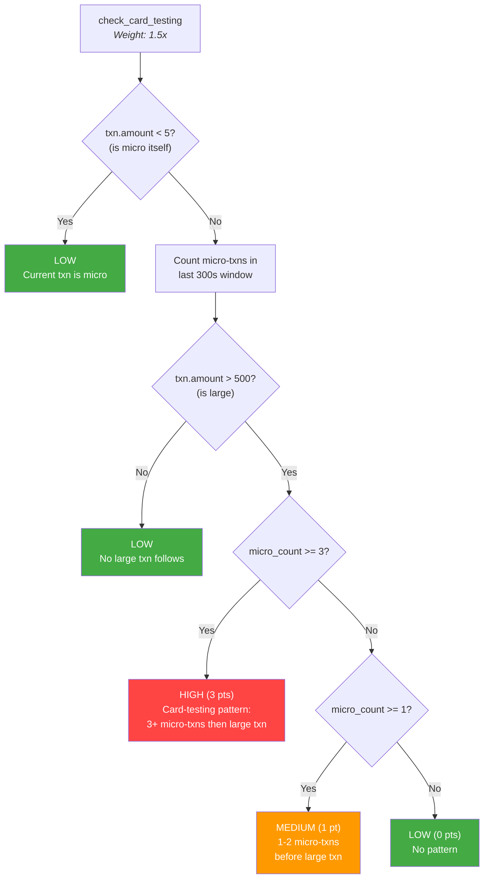

### 2. Amount-Based Rules

#### `check_amount_anomaly` (weight: 1.0x)

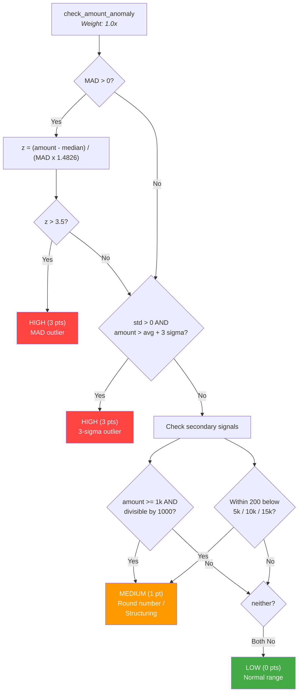

#### `check_balance_drain` (weight: 1.5x)

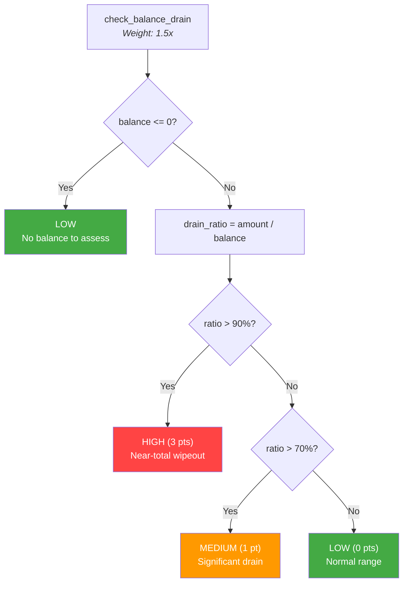

#### `check_first_large` (weight: 1.0x)

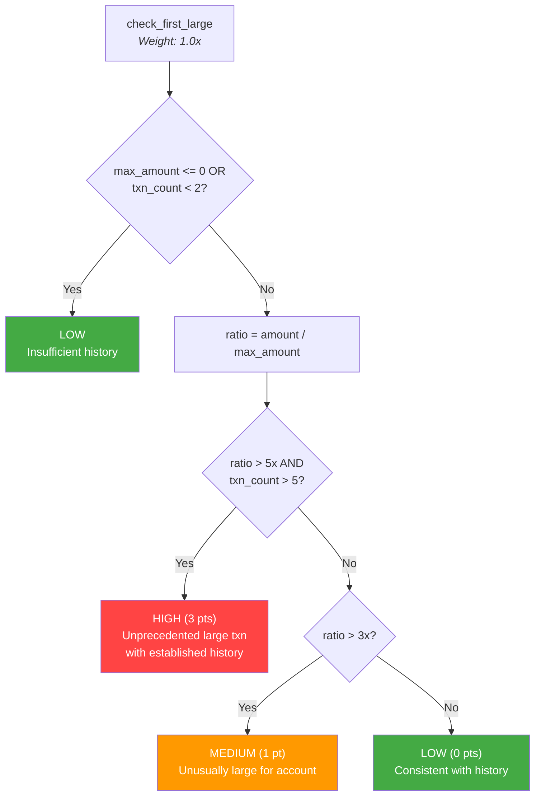

### 3. Behavioral Rules

#### `check_new_payee` (weight: 1.0x)

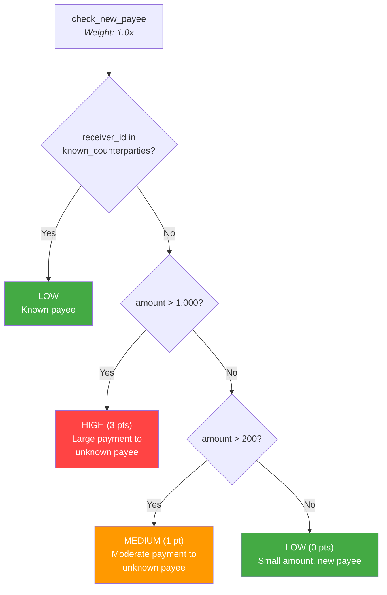

#### `check_dormant_reactivation` (weight: 1.0x)

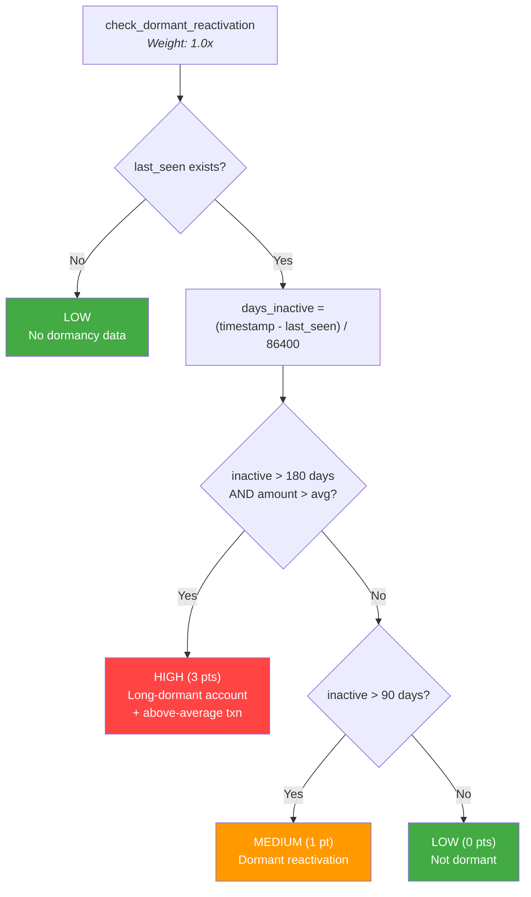

#### `check_frequency_shift` (weight: 1.0x)

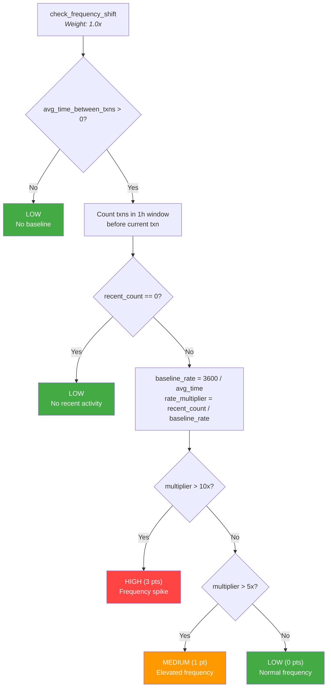

### 4. Graph / Network Rules

#### `check_fan_in` (weight: 2.0x)

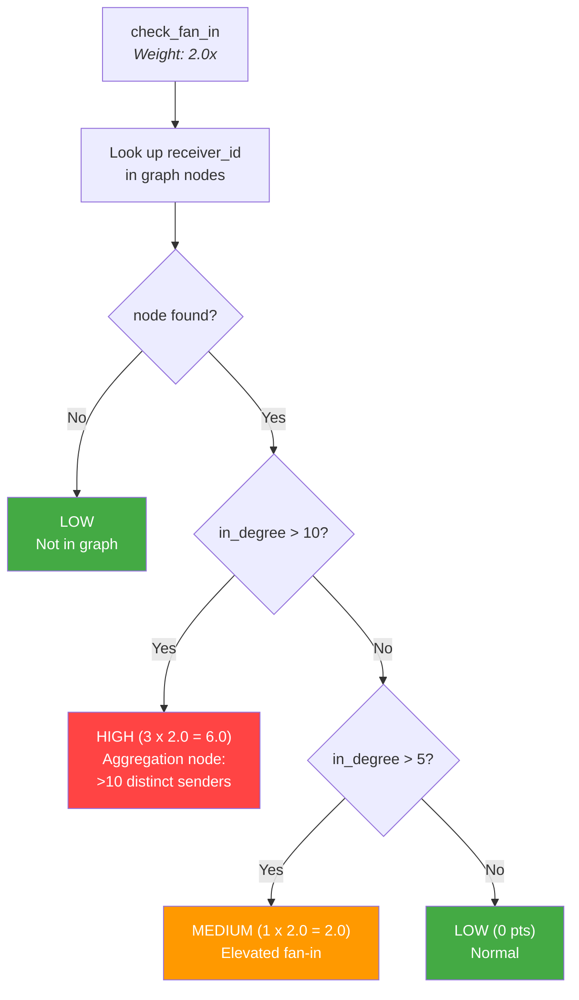

#### `check_fan_out` (weight: 2.0x)

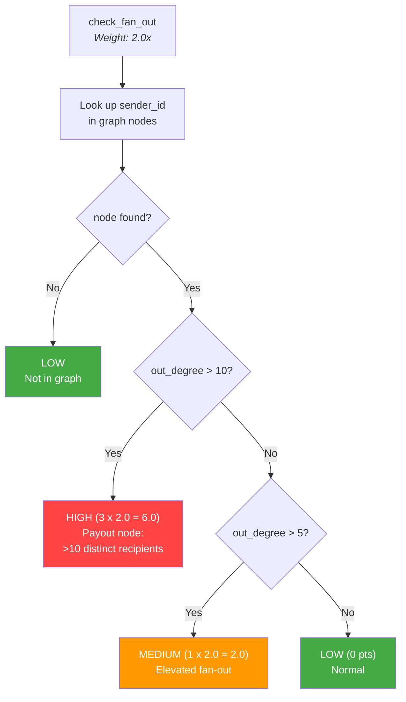

#### `check_mule_chain` (weight: 2.0x)

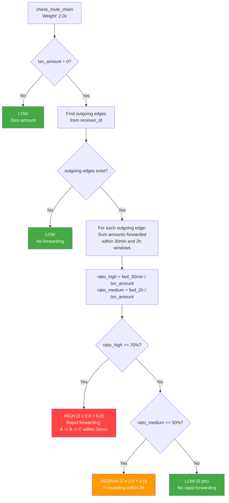

#### `check_circular_flow` (weight: 2.0x)

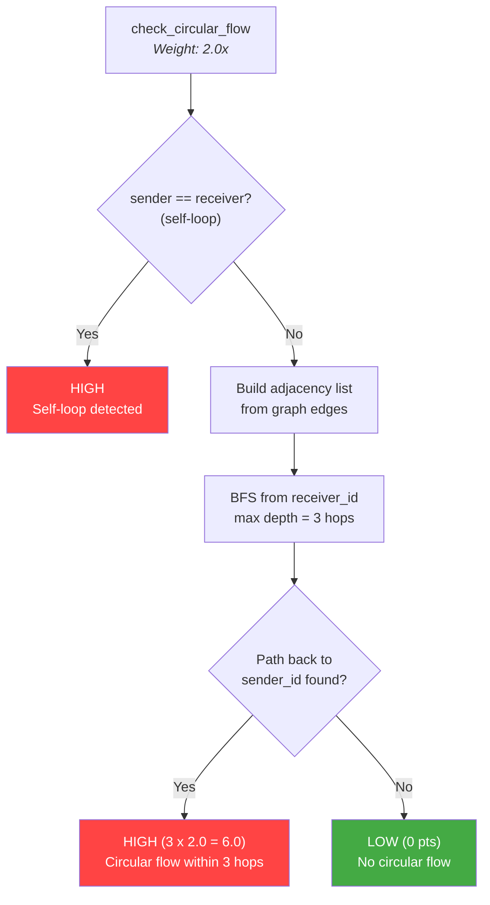

### 5. Geographic Rule

#### `check_impossible_travel` (weight: 2.0x)

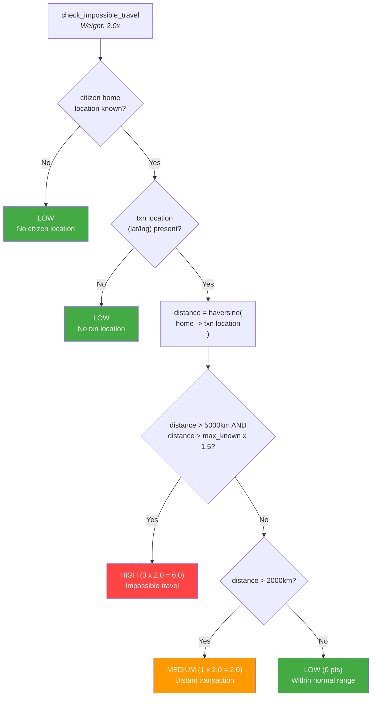

### 6. Composite Scoring Engine

#### `compute_composite_risk`

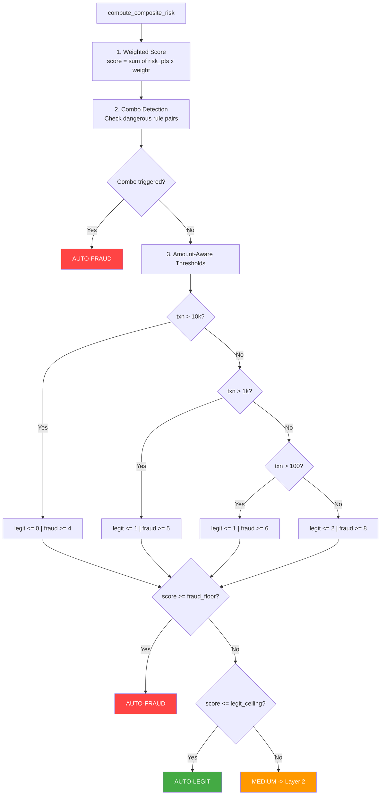

#### Always-Flag Combo Pairs

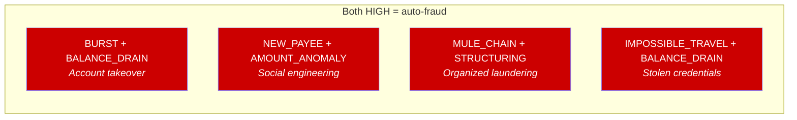
